# Arquitectura propuesta — Sistema de facturación cloud (ALITO GROUP SRL)

**Documento de arquitectura (nivel masivo / completo)**

- **Proyecto:** Sistema de facturación cloud con automatización (NCF/ITBIS), BI e IA.
- **Organización:** ALITO GROUP SRL (Bávaro – Punta Cana).
- **Contexto normativo:** República Dominicana (DGII / NCF / ITBIS).
- **Fecha de referencia:** 2026-01-11.

---

## 0) Cómo leer este documento

Este documento está diseñado para servir como “arquitectura total” del proyecto. Incluye:

1. Alcance funcional y no funcional (derivado de la documentación del anteproyecto).
2. Arquitectura objetivo por microservicios (sistema completo).
3. Diseño interno por microservicio usando **Arquitectura Hexagonal** (Ports & Adapters) y principios de **Clean Architecture**.
4. Comunicación, consistencia, datos, auditoría, seguridad y observabilidad.
5. Factibilidad real (coste/tiempo/complejidad) y riesgos.
6. Propuesta alternativa recomendada si se prioriza rapidez y menor riesgo: **Monolito modular con hexagonal, evolutivo a microservicios**.
7. Plan de migración y roadmap de implementación.

> Nota: la arquitectura está alineada con los problemas descritos: procesos manuales, dispersión de datos, errores de NCF/ITBIS, falta de trazabilidad, riesgos de auditoría DGII, ausencia de analítica y operación con conectividad inestable.

---

## 1) Fuentes y base de requerimientos

**Documentos usados como base (workspace):**

- Anteproyecto general y alcance: `anteproyecto/archivo final/anteproyecto_final_limpio.md`
- Problemas operativos y requerimientos implícitos: `anteproyecto/archivo final/planteamiento_problema.md`
- Variables/indicadores medibles (metas): `anteproyecto/archivo final/anexo3_variables_indicadores.md`
- Propuesta técnica ya redactada (microservicios + hexagonal + offline): `tesis/info/informe03.md`

---

## 2) Alcance del sistema (visión “sistema completo”)

### 2.1 Flujo end-to-end (mínimo imprescindible)

1. **Cliente / personal** solicita cotización (web o WhatsApp).
2. **Cotización** se genera, revisa y aprueba.
3. Se ejecuta el servicio (alquiler/entrega/horas/trabajo) y se gestiona una **proforma** como control del “cumplimiento” (parcialidades y avance).
4. Con proforma cerrada y pago validado, se emite **factura** con **NCF** y **ITBIS** correctamente.
5. Se registra en **cuentas por cobrar**, se generan estados de cuenta y alertas de vencimiento.
6. Se alimenta una capa de **analítica/BI** para KPI (errores, tiempos, DSO, antigüedad, etc.).

### 2.1.1 Diagrama de flujo (swimlanes)

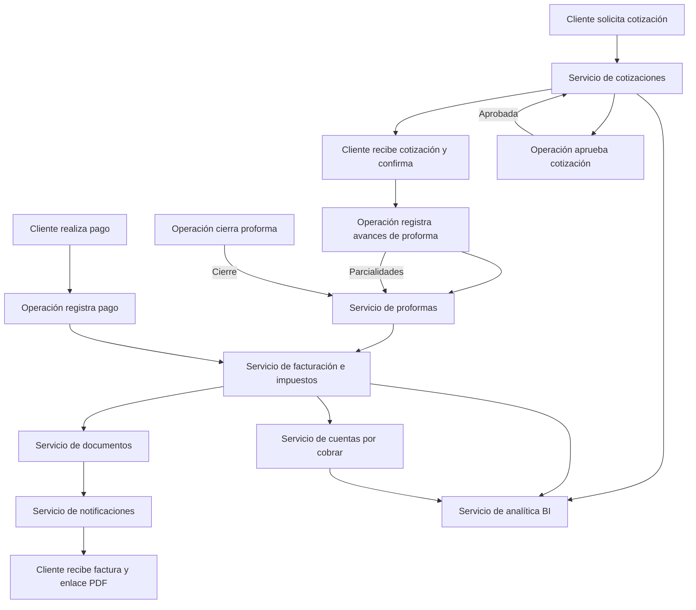

### 2.1.2 Diagrama de secuencia (happy-path)

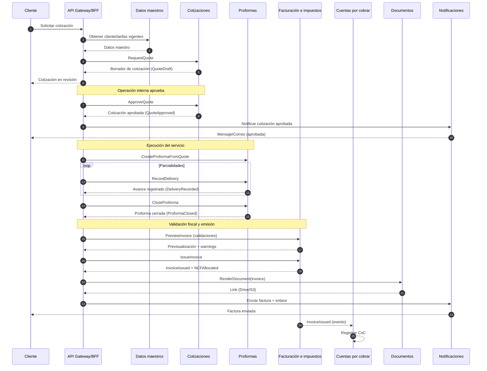

### 2.2 Módulos funcionales (capabilities)

- **Gestión de clientes** (RNC/Cédula, contactos, unicidad, historial).
- **Catálogo de servicios / tarifas** (versionado de precios, vigencias, reglas por tipo de servicio).
- **Cotizaciones** (vigencia, regeneración, canal WhatsApp/web, PDF/enlace).
- **Proformas** (parcialidades, avance diario, cierre, conciliación con cotización).
- **Facturación** (emisión final, impuestos, NCF, notas de crédito/débito si aplica, control de secuencia).
- **Cuentas por cobrar** (saldos, vencimientos, recordatorios, estados de cuenta, antigüedad).
- **Usuarios, roles y permisos** (RBAC).
- **Auditoría / trazabilidad** (quién hizo qué, cuándo, desde dónde; inmutabilidad lógica).
- **Documentos** (plantillas, generación PDF, almacenamiento externo y enlaces).
- **Automatizaciones** (notificaciones por WhatsApp/correo vía n8n u otro mecanismo).
- **IA aplicada (nivel MVP/realista)**:
  - Validación y detección de inconsistencias (NCF/ITBIS, duplicados, valores atípicos).
  - Extracción de datos desde mensajes/órdenes (WhatsApp) si se decide.
  - Asistencia para limpieza de datos maestros (nombres de clientes, errores tipográficos).
- **Modo offline / conectividad inestable** (captura local, sincronización segura).

### 2.3 Requisitos no funcionales (NFR)

- **Cumplimiento fiscal:** control estricto de NCF, tipos, vigencias, secuencias; cálculo consistente de ITBIS.
- **Trazabilidad/auditabilidad:** reconstrucción de expedientes para auditoría (DGII o interna).
- **Seguridad:** autenticación, RBAC, cifrado en tránsito y reposo, segregación de funciones.
- **Disponibilidad:** tolerancia a fallas parciales; continuidad operativa.
- **Resiliencia offline:** captura sin internet y sincronización sin duplicados.
- **Escalabilidad:** crecer con volumen de transacciones.
- **Mantenibilidad y testabilidad:** dominio aislado de infraestructura (hexagonal).

---

## 3) Decisión estratégica: ¿Microservicios “puros” o alternativa?

### 3.1 Microservicios “puros” (objetivo)

Ventajas:
- Aislamiento de fallos y despliegue independiente.
- Escalado por componente.
- Alineación con bounded contexts.

Costos / riesgos:
- Complejidad operativa: CI/CD, observabilidad, redes, seguridad distribuida.
- Consistencia eventual y transacciones distribuidas.
- Más piezas para un equipo pequeño.

### 3.2 Alternativa recomendada (frecuentemente “mejor” para factibilidad)

**Monolito modular con arquitectura hexagonal + DDD**, preparado para extraer microservicios.

Por qué suele ser mejor al inicio:
- Menos costo operativo y menos fallos por “complejidad distribuida”.
- Mantiene el beneficio principal que buscas: **dominio aislado** (hexagonal) y módulos claros.
- Permite entregar valor (cotizar→proforma→facturar con NCF/ITBIS) rápido.
- Luego se “extraen” servicios con evidencia (cuellos de botella reales).

**Recomendación práctica:**
- **Arquitectura objetivo documentada como microservicios** (para la tesis y escalabilidad).
- **Implementación fase 1 como monolito modular** (para viabilidad) y transición planificada.

Este documento cubre ambos: la arquitectura microservicios completa y el camino factible.

---

## 4) Arquitectura objetivo (microservicios) — Vista de alto nivel

### 4.1 Bounded Contexts (DDD) sugeridos

- **Identity & Access**: usuarios, roles, permisos, políticas.
- **Master Data**: clientes, catálogo de servicios, tarifas.
- **Quotation**: cotizaciones (vigencia, aprobación, regeneración).
- **Proforma/Delivery**: ejecución, parcialidades, cierre.
- **Billing & Tax**: facturación, impuestos, NCF, notas, reglas fiscales.
- **Accounts Receivable (AR)**: saldos, pagos, estados de cuenta, antigüedad.
- **Documents**: plantillas y generación de PDFs, enlaces, almacenamiento.
- **Notifications/Automation**: envío y recordatorios (WhatsApp/correo).
- **Analytics/BI**: KPIs, reportes, modelos de datos analíticos.
- **AI Assist**: validaciones inteligentes, extracción y limpieza de datos.
- **Sync/Offline**: ingestión de eventos offline y conciliación.

> Nota: en un MVP real, algunos bounded contexts se pueden unir inicialmente.

### 4.2 Componentes principales

- **API Gateway / BFF** (para web y para integraciones): enruta, autentica, aplica políticas.
- **Event Bus** (asíncrono): integra eventos de dominio y reduce acoplamiento.
- **Bases de datos por servicio** (ownership): cada microservicio es dueño de sus datos.
- **Observabilidad**: logs, métricas, trazas.

### 4.3 Diagrama (conceptual)

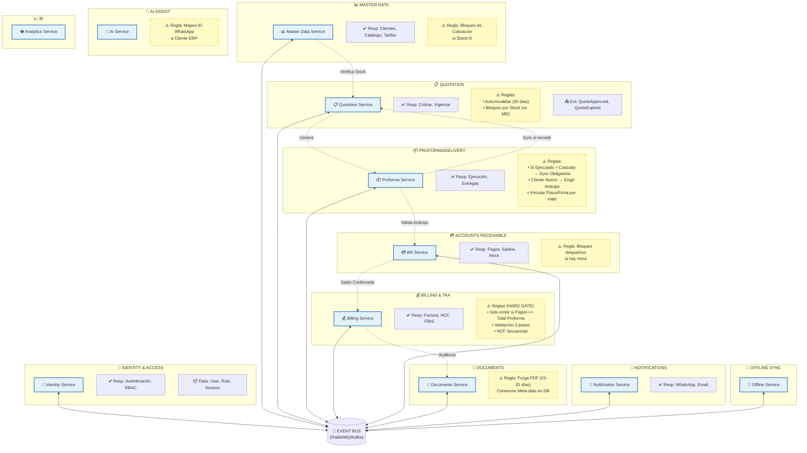

### 4.4 Vista C4 (Container View) — Qué corre y dónde vive

> Objetivo: que el lector identifique “contenedores ejecutables” (apps/servicios) y sus responsabilidades.

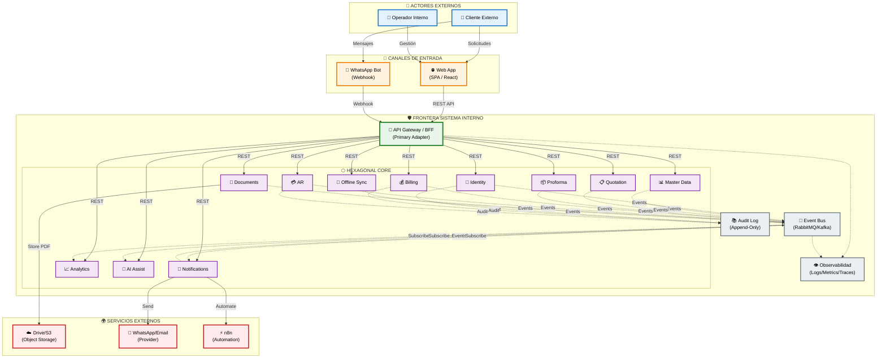

### 4.5 Vista de despliegue (alta abstracción)

> Esta vista no amarra a un proveedor cloud específico; describe una topología típica cloud-native.

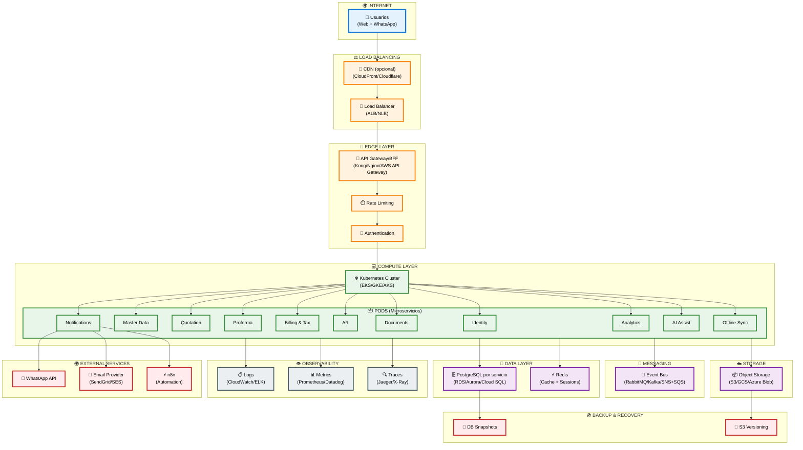

---

## 5) Microservicios propuestos (sistema completo)

A continuación se describe cada microservicio con:
- **Responsabilidad**
- **Datos (ownership)**
- **APIs/eventos clave**
- **Diseño hexagonal (puertos/adaptadores)**
- **Notas de consistencia y seguridad**

> Convención: cada servicio se implementa con capas: **Domain** (entidades/agregados/reglas), **Application** (casos de uso), **Adapters** (in/out), **Infrastructure**.

### 5.0 Patrón por servicio: Arquitectura Hexagonal (plantilla visual)

> Este diagrama se aplica a cada microservicio; cambia el nombre de puertos/adaptadores según el caso.

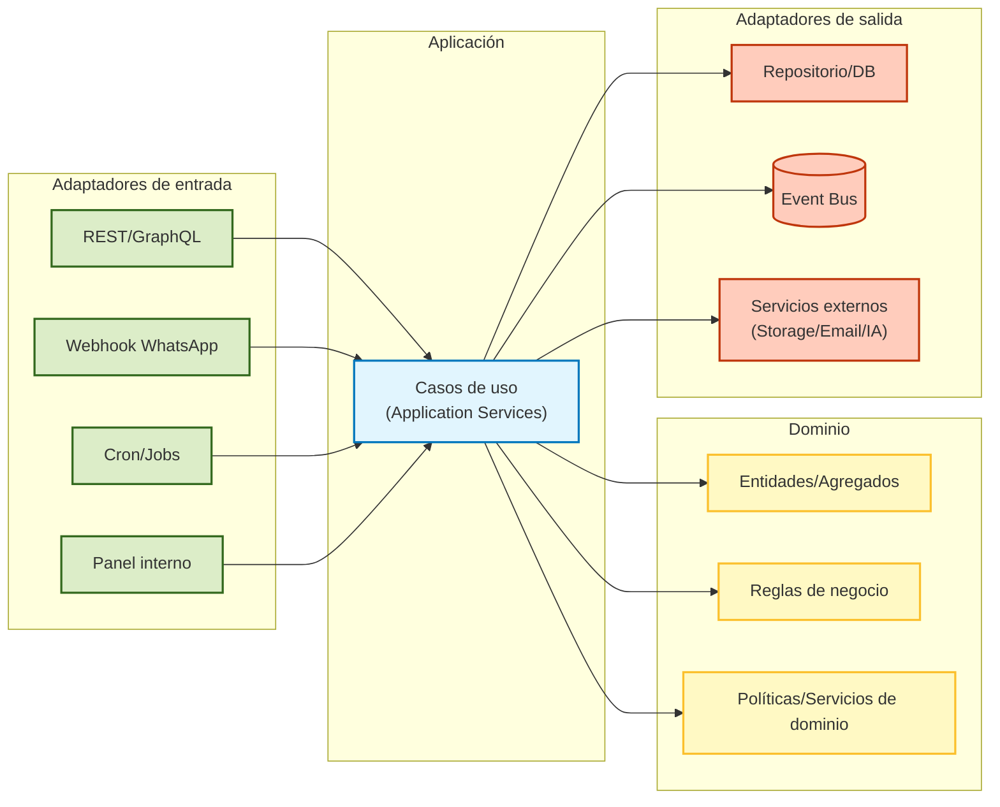

---

### 5.1 Identity Service (Usuarios y RBAC)

**Responsabilidad**
- Autenticación y autorización (RBAC).
- Emisión/validación de tokens.
- Gestión de usuarios, roles y permisos.

**Datos**
- Users, Roles, RoleBindings, Password/Identity providers.

**Puertos (Hexagonal)**
- **Inbound ports:** `Authenticate`, `Authorize`, `ManageUsers`.
- **Outbound ports:** `UserRepository`, `AuditLogPort`, `IdentityProviderPort`.

**Adaptadores**
- Inbound: HTTP REST (login, refresh, user admin).
- Outbound: DB, integración con proveedor (opcional), auditoría.

**Notas**
- Separación de funciones (ej.: rol facturador vs. administrador NCF).

---

### 5.2 Master Data Service (Clientes + Catálogo + Tarifas)

**Responsabilidad**
- Catálogo único de clientes (evitar duplicados) y datos fiscales (RNC/Cédula).
- Catálogo de servicios/equipos y tarifas con vigencias.

**Datos**
- Customer, CustomerContact, CustomerTaxProfile
- ServiceItem, PriceList, PriceRule (vigencia)

**Puertos**
- Inbound: `CreateCustomer`, `UpdateCustomer`, `SearchCustomer`, `UpsertPriceList`.
- Outbound: `MasterDataRepository`, `DuplicateDetectionPort` (IA opcional).

**Eventos**
- `CustomerCreated`, `CustomerUpdated`
- `PriceListUpdated`

**Reglas clave**
- Unicidad por RNC/Cédula.
- Versionado de tarifas por fecha.

---

### 5.3 Servicio de cotizaciones (Cotizaciones)

**Responsabilidad**
- Crear, revisar, aprobar y controlar vigencia de cotizaciones.
- Regeneración de cotización con tarifas vigentes.
- Exposición para canal Web/WhatsApp.

**Datos**
- Quote (aggregate), QuoteLine, QuoteStatus, ValidityWindow

**Puertos**
- Inbound: `RequestQuote`, `ApproveQuote`, `RejectQuote`, `ExpireQuotes`, `RegenerateQuote`.
- Outbound: `QuoteRepository`, `PricingPort` (consulta al Master Data), `DocumentPort` (crear PDF), `NotificationPort`.

**Eventos**
- `QuoteRequested`, `QuoteApproved`, `QuoteExpired`, `QuoteRegenerated`

**Hexagonal (detalle)**
- Dominio: reglas de vigencia (15–30 días), totales, impuestos estimados (si aplica).
- Aplicación: casos de uso para aprobación y transición de estados.
- Adaptadores: HTTP (panel interno), webhook WhatsApp (ingreso), job scheduler (expirar).

**Diagrama de estados (cotización)**

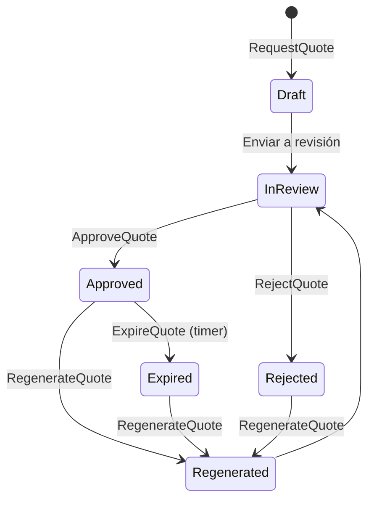

---

### 5.4 Servicio de proformas (Ejecución y control de entrega)

**Responsabilidad**
- Convertir una cotización aprobada en una proforma “ejecutable”.
- Registrar parcialidades (horas, metros, viajes, entregas) y cerrar proforma.

**Datos**
- Proforma (aggregate), DeliveryRecord, CompletionState

**Puertos**
- Inbound: `CreateProformaFromQuote`, `RecordDelivery`, `CloseProforma`.
- Outbound: `ProformaRepository`, `QuotationPort` (leer quote aprobado), `NotificationPort`.

**Eventos**
- `ProformaCreated`, `DeliveryRecorded`, `ProformaClosed`

**Reglas clave**
- No se factura si la proforma no está cerrada.
- La proforma es la “fuente de verdad” de lo realmente entregado.

**Diagrama de estados (proforma)**

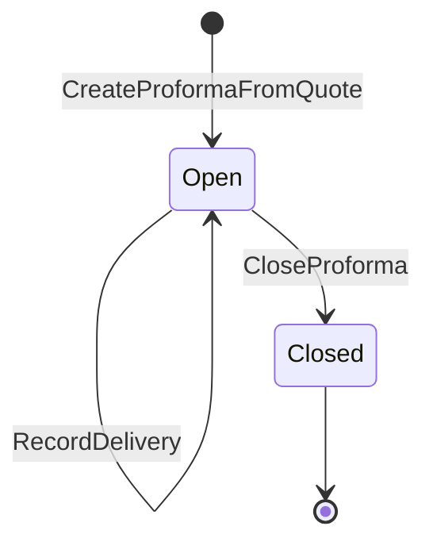

---

### 5.5 Servicio de facturación e impuestos (Facturación, NCF, ITBIS)

**Responsabilidad**
- Emitir facturas fiscales, controlar NCF, aplicar ITBIS.
- Validaciones de secuencia, tipo, vigencia.
- Proceso de “confirmación en pasos” antes de emitir documento fiscal.

**Datos**
- Invoice (aggregate), InvoiceLine, TaxBreakdown
- NCFSequence (aggregate), NCFAllocation, NCFType
- CreditNote / DebitNote (si se incluye)

**Puertos**
- Inbound: `IssueInvoice`, `PreviewInvoice`, `ValidateNCF`, `ManageNCFSequences`.
- Outbound: `BillingRepository`, `NCFRepository`, `ProformaPort`, `MasterDataPort`, `DocumentPort`, `AuditPort`.

**Eventos**
- `InvoiceIssued`, `NCFAllocated`, `InvoiceVoided` (si aplica), `TaxValidationFailed`

**Reglas clave (mínimo viable)**
- NCF no duplicado.
- NCF secuencial sin saltos no justificados.
- Tipo NCF correcto según perfil del cliente.
- ITBIS calculado consistentemente (redondeos estandarizados).

**Notas**
- Si se agrega e-CF / firma digital, esto crece bastante en complejidad y costo.

**Diagrama de secuencia (emisión fiscal con validaciones)**

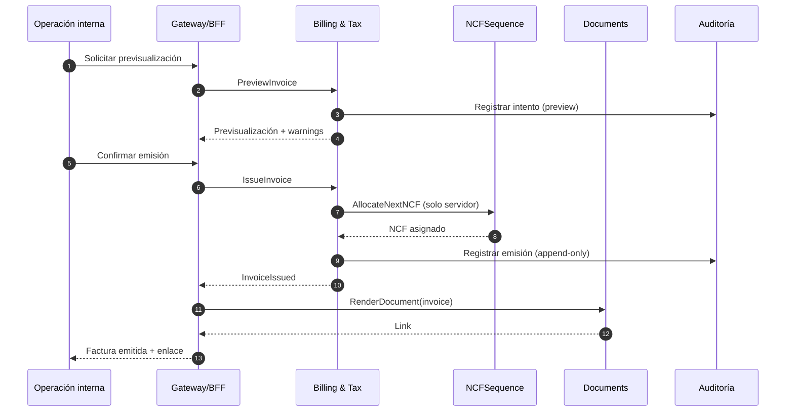

**Diagrama de estados (factura)**

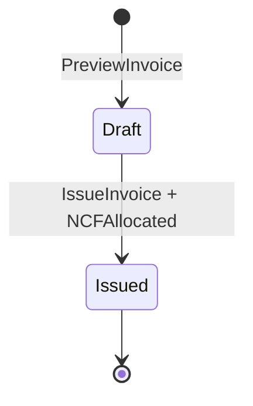

---

### 5.6 Accounts Receivable Service (Cuentas por cobrar)

**Responsabilidad**
- Registrar cuentas por cobrar desde facturas.
- Pagos, saldo, vencimientos, estados de cuenta.
- Análisis de antigüedad (0–30/31–60/61–90/90+).

**Datos**
- Account, ARInvoiceRef, Payment, AgingSnapshot

**Puertos**
- Inbound: `RegisterInvoiceAR`, `ApplyPayment`, `GenerateStatement`, `ComputeAging`.
- Outbound: `ARRepository`, `BillingPort`, `NotificationPort`.

**Eventos**
- Consume: `InvoiceIssued`
- Produce: `PaymentApplied`, `StatementGenerated`, `InvoiceOverdue`

---

### 5.7 Servicio de documentos (Generación/almacenamiento de PDFs)

**Responsabilidad**
- Render de documentos (cotización/proforma/factura/estado de cuenta) a PDF.
- Almacenamiento externo y entrega por enlaces.

**Datos**
- DocumentTemplate, DocumentRenderJob, DocumentLink

**Puertos**
- Inbound: `RenderDocument`, `GetDocumentLink`.
- Outbound: `TemplateRepository`, `FileStoragePort` (Drive/S3), `PDFRendererPort`.

**Notas**
- Mantener DB “liviana”: se guardan datos estructurados + enlace, no PDFs en DB.

---

### 5.8 Notifications/Automation Service (n8n u orquestación)

**Responsabilidad**
- Enviar notificaciones por cambios de estado: cotización aprobada, proforma actualizada, factura emitida, vencimientos.

**Enfoque**
- Puede ser un microservicio propio o una integración con n8n self-host.

**Puertos**
- Inbound: consumer de eventos (`QuoteApproved`, `InvoiceIssued`, `InvoiceOverdue`).
- Outbound: `WhatsAppProviderPort`, `EmailProviderPort`.

---

### 5.9 Analytics/BI Service

**Responsabilidad**
- Modelado analítico, KPIs y dashboards.

**Estrategia de datos**
- Ingesta por eventos (CDC o event bus) hacia un modelo analítico.
- Evitar queries “pesadas” contra DB transaccionales.

**KPIs base** (alineados al anexo de indicadores)
- % validaciones NCF/ITBIS automatizadas
- Errores NCF antes/después
- Tiempo de emisión por documento
- DSO y antigüedad
- % expedientes auditables

---

### 5.10 AI Assist Service (IA aplicada)

**Responsabilidad**
- Validaciones inteligentes, detección de anomalías, extracción de datos.

**Principio clave**
- La IA no debe “decidir” sola en lo fiscal: debe **asistir** y dejar rastro.

**Casos de uso realistas**
- Detectar duplicados de clientes (fuzzy matching).
- Alertar valores atípicos (tarifa fuera de rango).
- Extraer datos desde mensajes/adjuntos (si se implementa WhatsApp ingestion).

**Puertos**
- Inbound: `ValidateData`, `SuggestCorrections`.
- Outbound: `ModelProviderPort`, `FeatureStorePort` (opcional).

---

### 5.11 Offline Sync Service (captura y conciliación)

**Responsabilidad**
- Recibir lotes de transacciones capturadas offline.
- Reconciliar secuencias y evitar duplicados.

**Modelo recomendado**
- El cliente genera **IDs deterministas** (UUIDs) y el servidor resuelve numeraciones humanas (ej.: secuencias internas/folio) al sincronizar.
- Para NCF: **solo el servidor asigna**.

**Flujo de sincronización offline (sin colisiones)**

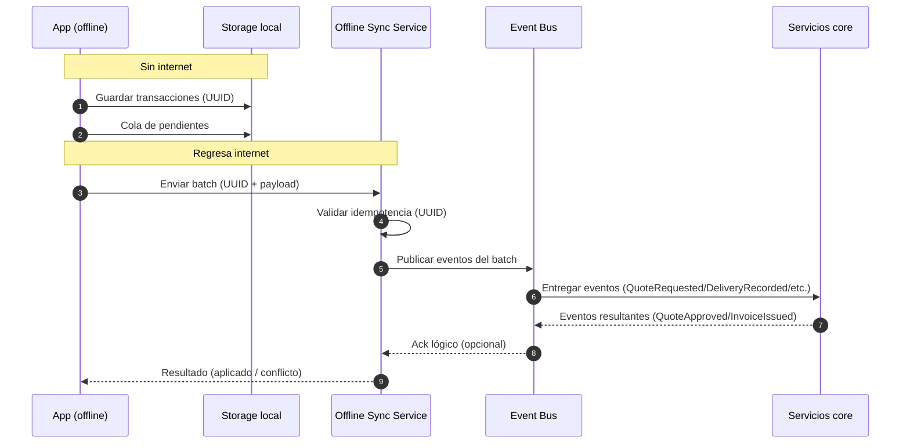

**Eventos**
- `OfflineBatchReceived`, `OfflineBatchApplied`, `ConflictDetected`

---

## 6) Comunicación entre microservicios

### 6.1 Sincrónico vs asíncrono

- **Sincrónico (REST/gRPC)**: consultas necesarias de UX (ej. buscar clientes, previsualizar factura).
- **Asíncrono (event bus)**: propagación de cambios (ej. `InvoiceIssued` → AR + BI + Notificaciones).

### 6.2 Contratos y versionado

- Contratos API documentados (OpenAPI) y versionados.
- Eventos versionados (schema registry o convención interna).

### 6.3 Consistencia

- Preferir consistencia eventual entre bounded contexts.
- Transacciones locales dentro de cada servicio (ACID).
- Para flujos multi-servicio usar **Sagas** (coreografía por eventos) o un orquestador.

Ejemplo de saga:
1) Proforma cerrada → solicita emisión
2) Billing emite factura + NCF
3) AR registra cuenta por cobrar
4) Notifications envía factura

### 6.4 Saga (coreografía por eventos) — Diagrama

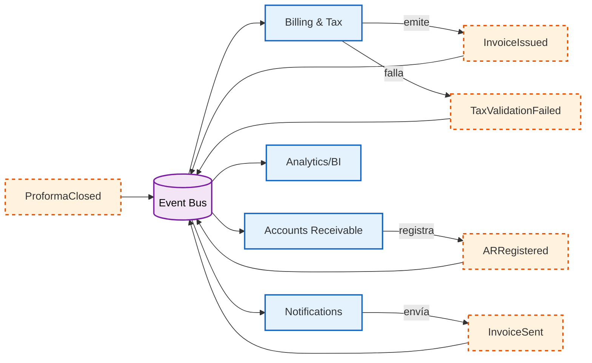

---

## 7) Gestión de datos

### 7.1 “Database per service” (ownership)

Regla: un servicio no escribe en la DB de otro servicio.

### 7.2 Integridad fiscal y auditoría

- Facturas y eventos clave con **inmutabilidad lógica** (no borrar; corregir con notas/anulación según regla).
- Registro de auditoría: usuario, timestamp, acción, entidad, antes/después.

### 7.3 Retención

- Definir políticas de retención y respaldos (especialmente para auditorías DGII).

---

## 8) Seguridad

### 8.1 Autenticación/Autorización

- JWT/OAuth2 (según stack).
- RBAC con permisos por capability (ej.: administrar NCF es distinto a emitir factura).

### 8.2 Segregación de funciones

- Evitar que el mismo rol configure secuencias NCF y emita facturas sin controles.

### 8.3 Auditoría y cumplimiento

- Logs inmutables (WORM si se puede en cloud) o al menos append-only.

---

## 9) Observabilidad

- Logs estructurados con correlación (trace-id).
- Métricas: latencia APIs, errores, colas, tiempo de emisión, tasa de validaciones.
- Trazas distribuidas: esencial si hay microservicios.

---

## 10) Factibilidad (qué tan viable es realmente)

### 10.1 Conclusión honesta

**Sí es factible**, pero la factibilidad depende de la “forma”:

- Microservicios completos desde el día 1: **viable pero costoso** en operación y coordinación.
- Monolito modular hexagonal (fase 1) + extracción gradual: **más viable** para un equipo pequeño y un contexto académico-empresarial.

### 10.2 Riesgos principales

- Complejidad distribuida (observabilidad, seguridad, despliegues).
- Consistencia eventual (errores por mal diseño de eventos).
- Gestión NCF (debe ser estricta, centralizada y auditable).
- Offline sync (conflictos de numeración si se diseña mal).

### 10.3 Mitigaciones

- Mantener NCF y emisión fiscal en un servicio central (Billing).
- Diseñar eventos con idempotencia.
- Empezar con monolito modular y extraer.

---

## 11) Propuesta alternativa (recomendada): Monolito modular hexagonal evolutivo

### 11.1 Qué es

Una sola aplicación desplegable con módulos internos:
- `identity`
- `masterdata`
- `quotation`
- `proforma`
- `billing_tax`
- `accounts_receivable`
- `documents`
- `analytics`

Cada módulo:
- Tiene dominio propio.
- Se comunica por interfaces internas (puertos) y eventos internos.
- Puede tener “schema” separado en la misma DB (o DB separadas en el mismo cluster) para simular ownership.

### 11.2 Por qué encaja con esta tesis

- Mantiene el foco académico: DDD + Hexagonal + Clean Architecture.
- Permite mostrar una “arquitectura moderna” sin caer en sobrecosto operativo.
- Facilita pruebas e incrementa probabilidad de éxito del MVP.

### 11.3 Cómo se migra a microservicios

1. Convertir eventos internos a eventos en bus.
2. Extraer primero “Documents” y “Notifications” (alto desacoplamiento).
3. Luego “Analytics/BI”.
4. Después “Quotation/Proforma” si el volumen lo requiere.
5. Mantener “Billing & Tax” central por control fiscal.

---

## 12) Roadmap sugerido (entregas)

### Fase 0 — Descubrimiento (corto)
- Reglas NCF/ITBIS, tipos de NCF, flujos y roles.
- Catálogo inicial y migración mínima.

### Fase 1 — MVP transaccional
- Clientes + catálogo + cotización + proforma + facturación (NCF/ITBIS).
- Auditoría básica.
- Documentos PDF.

### Fase 2 — Cuentas por cobrar y BI
- AR (pagos, vencimientos, estados de cuenta).
- KPI mínimos + dashboard.

### Fase 3 — IA asistiva
- Detección de duplicados, validaciones inteligentes.

### Fase 4 — Offline robusto
- Sync service (si no se implementó antes).

---

## 13) Apéndices

### A) Principios de diseño (checklist)

- Dominio no depende de infraestructura.
- Repositorios como puertos.
- Adaptadores intercambiables.
- Eventos idempotentes.
- Control fiscal centralizado.

### B) Glosario

- **NCF:** Número de Comprobante Fiscal.
- **ITBIS:** Impuesto a las Transferencias de Bienes Industrializados y Servicios.
- **Hexagonal:** Puertos y adaptadores.
- **DDD:** Domain-Driven Design.
- **Saga:** patrón para coordinar transacciones distribuidas.

---

## 14) Próximo paso

Si quieres, en el siguiente paso convierto esta arquitectura en:
- Lista de endpoints (OpenAPI) por servicio.
- Lista de eventos (schemas) por bounded context.
- Modelo de datos conceptual (entidades/agregados) por microservicio.
