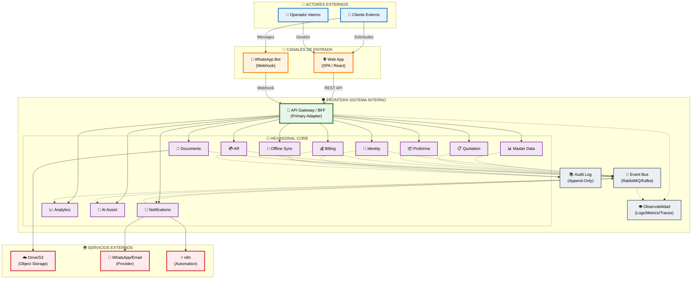
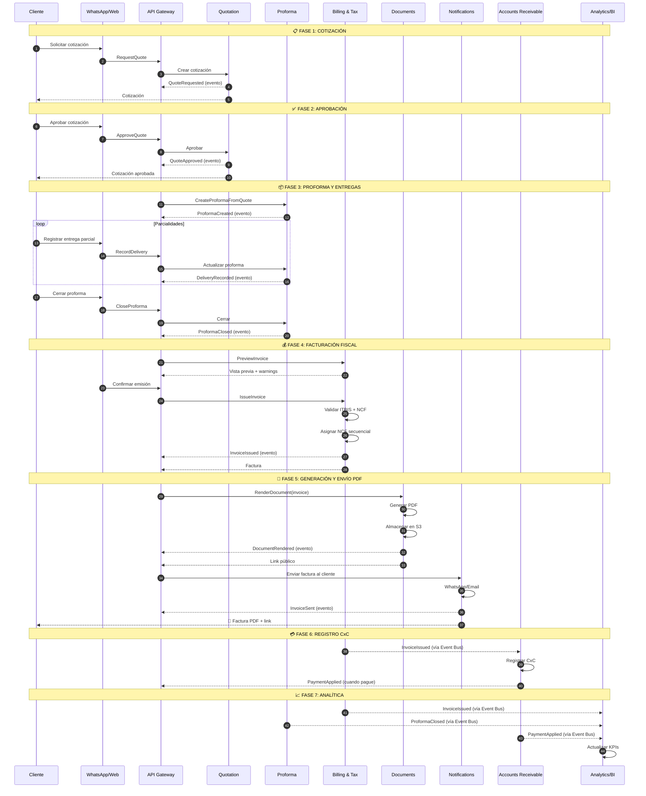
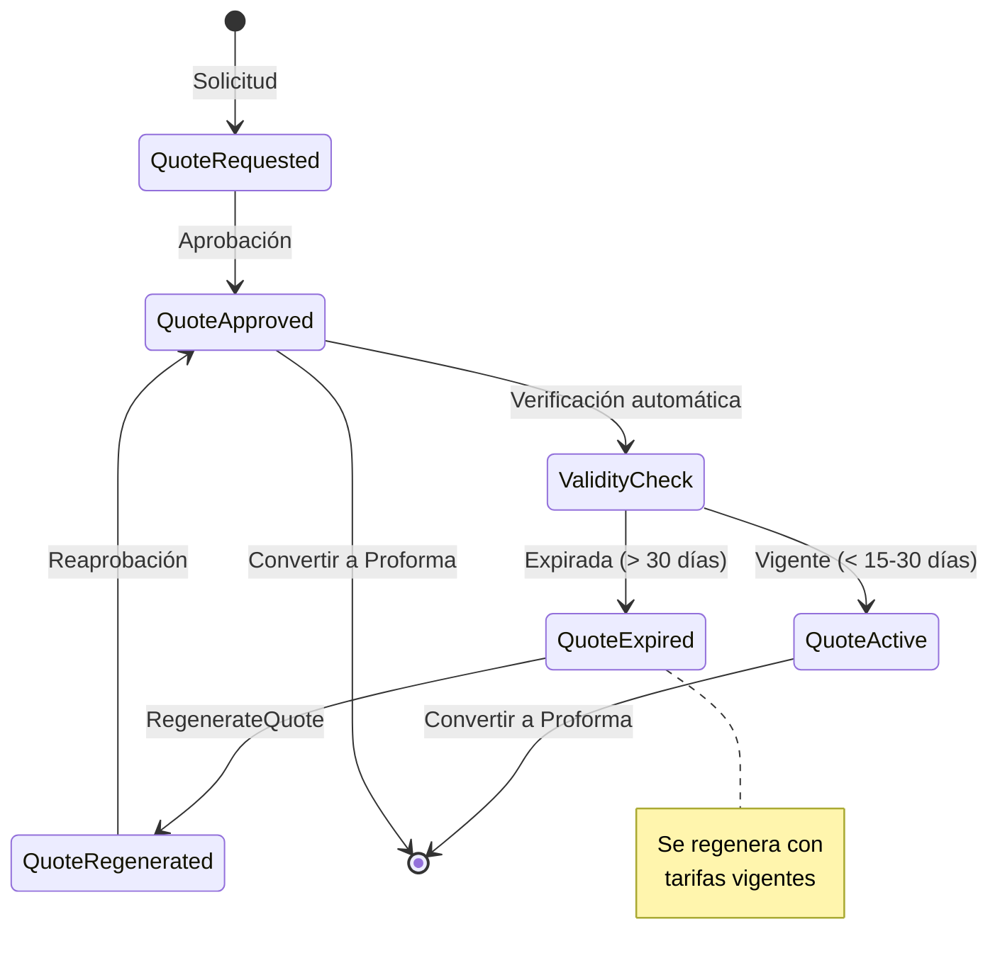
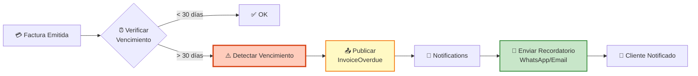
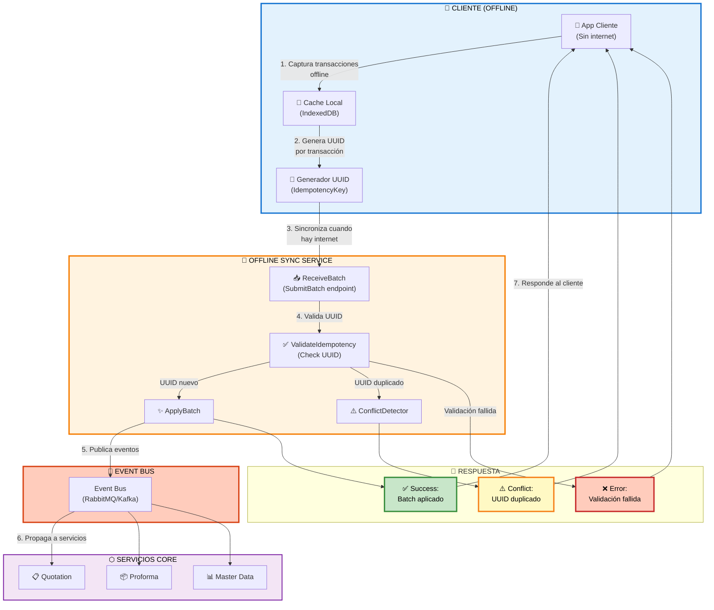
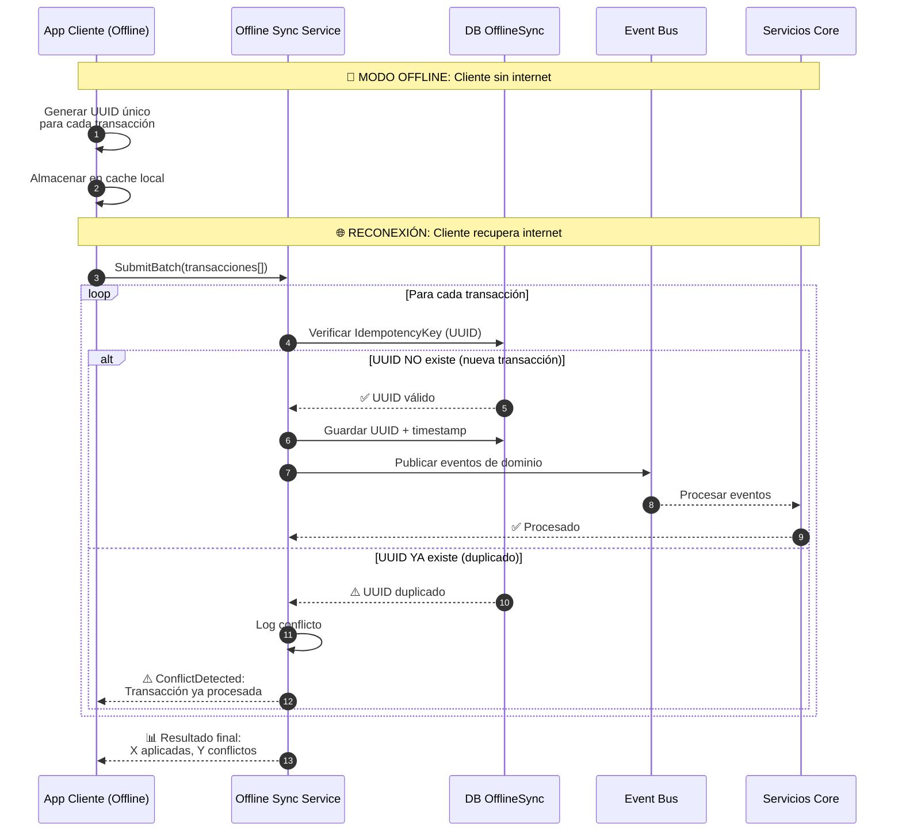
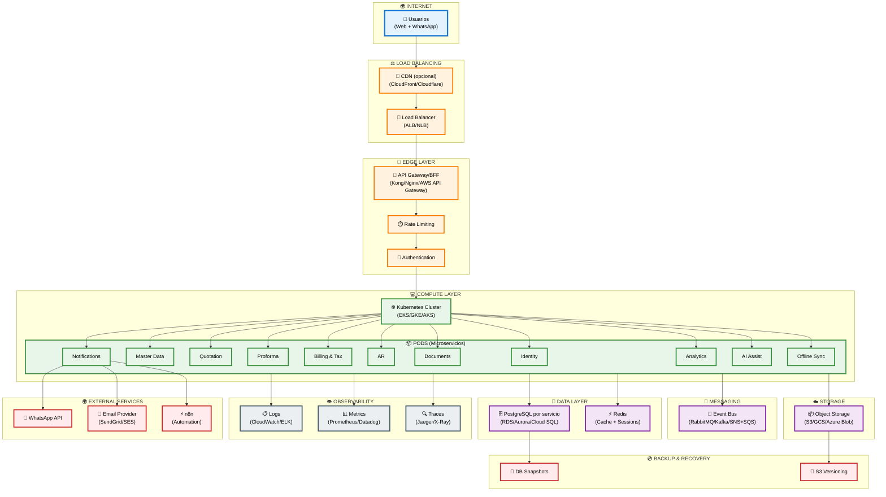

# Sistema de Facturación Cloud — ALITO GROUP SRL

## Representación Visual Moderna (4 Vistas + Despliegue)

**Proyecto:** ALITO GROUP SRL
**Fecha:** 2026-01-13
**Arquitectura:** Microservicios + Hexagonal + DDD

---

## 🏗️ VISTA A — Contenedores y Fronteras (C4 Model)

---

## 🎯 VISTA B — Microservicios y Bounded Contexts (DDD)

```mermaid
flowchart TB
    %% Event Bus Central
    EventBus[("🔁 EVENT BUS\n(RabbitMQ/Kafka)")]

    %% Microservicios (usamos *_SVC como nodos ancla)
    subgraph Identity["🔐 IDENTITY & ACCESS"]
        direction TB
        ID_SVC["🔐 Identity & Access"]
        I_DB[("DB Identity")]
        I_OBS["Obs"]
    end

    subgraph MasterData["📊 MASTER DATA"]
        direction TB
        MD_SVC["📊 Master Data"]
        MD_DB[("DB MasterData")]
        MD_OBS["Obs"]
    end

    subgraph Quotation["📋 QUOTATION"]
        direction TB
        Q_SVC["📋 Quotation"]
        Q_DB[("DB Quotation")]
        Q_OBS["Obs"]
    end

    subgraph Proforma["📦 PROFORMA/DELIVERY"]
        direction TB
        P_SVC["📦 Proforma/Delivery"]
        P_DB[("DB Proforma")]
        P_OBS["Obs"]
    end

    subgraph Billing["💰 BILLING & TAX"]
        direction TB
        B_SVC["💰 Billing & Tax"]
        B_DB[("DB Billing")]
        B_OBS["Obs"]
    end

    subgraph AR["💳 ACCOUNTS RECEIVABLE"]
        direction TB
        AR_SVC["💳 Accounts Receivable"]
        AR_DB[("DB AR")]
        AR_OBS["Obs"]
    end

    subgraph Documents["📄 DOCUMENTS"]
        direction TB
        D_SVC["📄 Documents"]
        D_DB[("DB Documents")]
        D_OBS["Obs"]
    end

    subgraph Notifications["🔔 NOTIFICATIONS"]
        direction TB
        N_SVC["🔔 Notifications"]
        N_DB[("DB Notifications")]
        N_OBS["Obs"]
    end

    subgraph Analytics["📈 ANALYTICS/BI"]
        direction TB
        A_SVC["📈 Analytics/BI"]
        A_DB[("DB Analytics")]
        A_OBS["Obs"]
    end

    subgraph AI["🤖 AI ASSIST"]
        AI_SVC["🤖 AI Assist"]
        AI_OBS["Obs"]
    end

    subgraph OfflineSync["🔄 OFFLINE SYNC"]
        direction TB
        OS_SVC["🔄 Offline Sync"]
        OS_DB[("DB OfflineSync")]
        OS_OBS["Obs"]
    end

    %% Publican eventos
    ID_SVC -.-> EventBus
    MD_SVC -.-> EventBus
    Q_SVC -.-> EventBus
    P_SVC -.-> EventBus
    B_SVC -.-> EventBus
    AR_SVC -.-> EventBus
    D_SVC -.-> EventBus
    N_SVC -.-> EventBus
    OS_SVC -.-> EventBus

    %% Consumen eventos
    EventBus -.-> AR_SVC
    EventBus -.-> N_SVC
    EventBus -.-> A_SVC
    EventBus -.-> AI_SVC

    %% Estilos simples (compatibles con mermaid 8.8)
    classDef coreService fill:#e1f5fe,stroke:#0277bd,stroke-width:2px,color:#000
    classDef fiscalService fill:#fff9c4,stroke:#f57f17,stroke-width:2px,color:#000
    classDef supportService fill:#f3e5f5,stroke:#7b1fa2,stroke-width:2px,color:#000
    classDef eventBusStyle fill:#ffccbc,stroke:#d84315,stroke-width:3px,color:#000

    class ID_SVC,MD_SVC,Q_SVC,P_SVC coreService
    class B_SVC fiscalService
    class AR_SVC,D_SVC,N_SVC,A_SVC,AI_SVC,OS_SVC supportService
    class EventBus eventBusStyle
```

---

## 🔄 VISTA C — Flujos de Negocio End-to-End

### Flujo Principal: Solicitud → Factura → CxC

### Flujo Secundario 1: Expiración y Regeneración de Cotización

### Flujo Secundario 2: Vencimiento y Recordatorio CxC

---

## 🔄 VISTA D — Offline Sync (Modo Sin Internet)

### Mecanismo de Idempotencia

---

## 🚀 MINI-VISTA DE DESPLIEGUE (Lógica Cloud-Native)

---

## 📊 RESUMEN DE COMPONENTES

### Microservicios (11 total)

| #  | Microservicio            | DB Propia      | Event Publisher | Event Consumer     |
| -- | ------------------------ | -------------- | --------------- | ------------------ |
| 1  | Identity & Access        | ✅             | ✅              | ❌                 |
| 2  | Master Data              | ✅             | ✅              | ❌                 |
| 3  | Quotation                | ✅             | ✅              | ❌                 |
| 4  | Proforma/Delivery        | ✅             | ✅              | ❌                 |
| 5  | Billing & Tax            | ✅             | ✅              | ❌                 |
| 6  | Accounts Receivable      | ✅             | ✅              | ✅ (InvoiceIssued) |
| 7  | Documents                | ✅             | ✅              | ❌                 |
| 8  | Notifications/Automation | ✅             | ✅              | ✅ (Multi-eventos) |
| 9  | Analytics/BI             | ✅ (Data Mart) | ❌              | ✅ (Todos)         |
| 10 | AI Assist                | ❌ (Stateless) | ❌              | ✅ (Eventos clave) |
| 11 | Offline Sync             | ✅             | ✅              | ❌                 |

### Eventos de Dominio (Principales)

#### Quotation

- `QuoteRequested`, `QuoteApproved`, `QuoteRejected`, `QuoteExpired`, `QuoteRegenerated`

#### Proforma

- `ProformaCreated`, `DeliveryRecorded`, `ProformaClosed`

#### Billing & Tax

- `InvoiceIssued`, `NCFAllocated`, `TaxValidationFailed`, `InvoiceVoided`

#### Accounts Receivable

- `PaymentApplied`, `StatementGenerated`, `InvoiceOverdue`

#### Documents

- `DocumentRendered`, `DocumentStorageFailed`

#### Notifications

- `InvoiceSent`, `NotificationFailed`

#### Offline Sync

- `OfflineBatchReceived`, `OfflineBatchApplied`, `ConflictDetected`

---

## 🔒 Reglas Clave de Negocio

### 1. Facturación Fiscal (Billing & Tax)

- ✅ **NCF único y secuencial** (sin duplicados ni saltos)
- ✅ **ITBIS 18%** con redondeo consistente
- ✅ **Proceso en 2 pasos:** PreviewInvoice → IssueInvoice
- ✅ **Auditoría append-only** de todos los intentos
- ✅ **NCF solo se asigna en servidor** (nunca en cliente)

### 2. Cotizaciones (Quotation)

- ✅ **Vigencia 15-30 días**
- ✅ **Regeneración automática** con tarifas vigentes si expira
- ✅ **Aprobación obligatoria** antes de convertir a proforma

### 3. Proformas (Proforma/Delivery)

- ✅ **No se puede facturar sin proforma cerrada**
- ✅ **Registro de parcialidades** antes de cierre
- ✅ **Conciliación con cotización** original

### 4. Cuentas por Cobrar (AR)

- ✅ **Detección automática de vencimientos**
- ✅ **Análisis de antigüedad** (0-30/31-60/61-90/90+)
- ✅ **Recordatorios automáticos** vía WhatsApp/Email

### 5. Offline Sync

- ✅ **Idempotencia garantizada** con UUID
- ✅ **Detección y resolución de conflictos**
- ✅ **Sincronización batch** al recuperar internet

---

## 🎯 Próximos Pasos

1. ✅ **Validar diagramas** con stakeholders
2. ⬜ **Definir APIs detalladas** (OpenAPI/Swagger)
3. ⬜ **Modelar esquemas de eventos** (AsyncAPI)
4. ⬜ **Diseñar modelos de datos** por microservicio
5. ⬜ **Planificar roadmap de implementación** (MVP → completo)
6. ⬜ **Configurar infraestructura** (IaC con Terraform/Pulumi)

---

**Documento generado:** 2026-01-13
**Herramienta:** GitHub Copilot + Mermaid
**Estado:** ✅ Completo y listo para implementación
