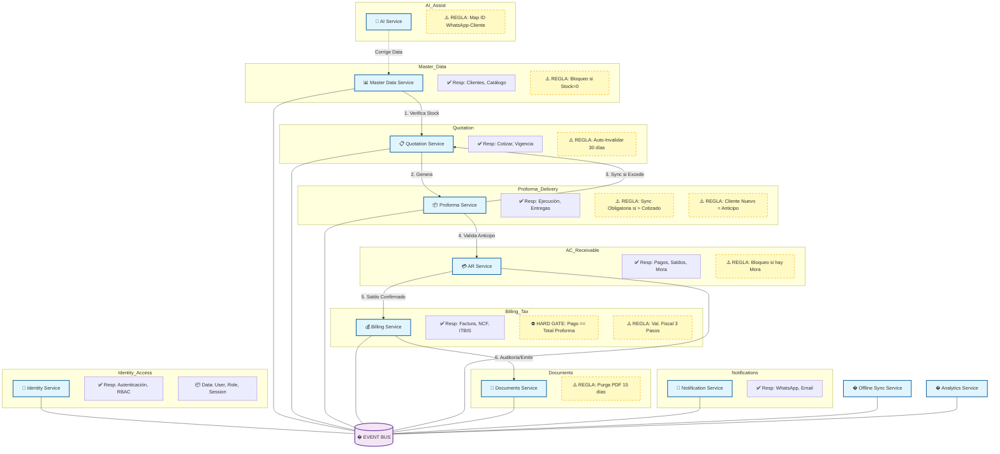
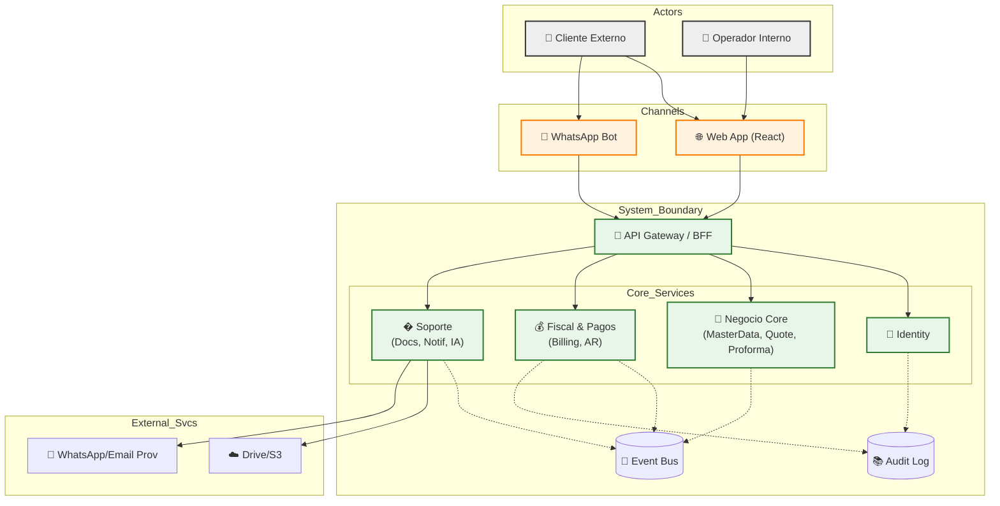
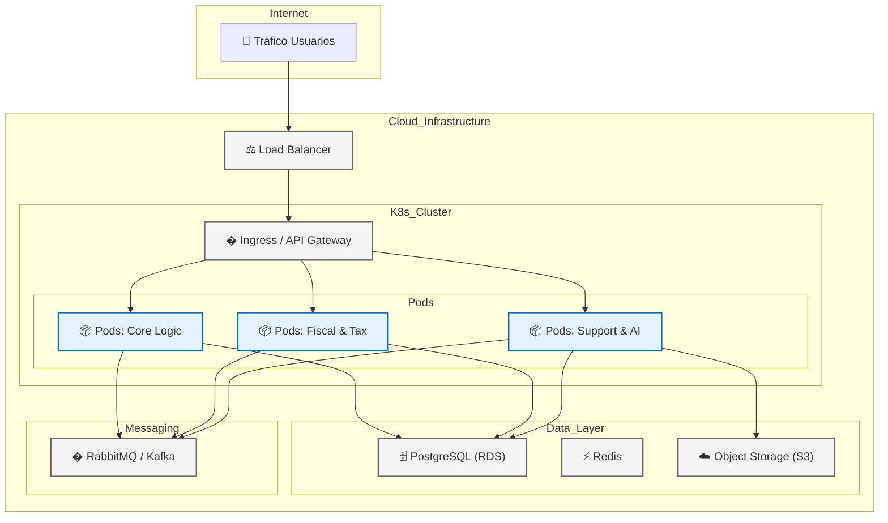

```mermaid
graph TB
    %% VISTA B: MICROSERVICIOS, LOGICA & REGLAS DE NEGOCIO (DDD)
    %% Diseñado para compatibilidad con Mermaid 8.8.0

    %% Identity
    subgraph Identity_Access
        ID_SVC["🔐 Identity Service"]
        I_RESP["✅ Resp: Autenticación, RBAC"]
        I_DATA["📦 Data: User, Role, Session"]
    end

    %% Master Data
    subgraph Master_Data
        MD_SVC["📊 Master Data Service"]
        MD_RESP["✅ Resp: Clientes, Catálogo"]
        MD_RULE["⚠️ REGLA: Bloqueo si Stock=0"]
    end

    %% Quotation
    subgraph Quotation
        Q_SVC["📋 Quotation Service"]
        Q_RESP["✅ Resp: Cotizar, Vigencia"]
        Q_RULE["⚠️ REGLA: Auto-Invalidar 30 días"]
    end

    %% Proforma
    subgraph Proforma_Delivery
        P_SVC["📦 Proforma Service"]
        P_RESP["✅ Resp: Ejecución, Entregas"]
        P_RULE["⚠️ REGLA: Sync Obligatoria si > Cotizado"]
        P_RULE2["⚠️ REGLA: Cliente Nuevo = Anticipo"]
    end

    %% Billing (Fiscal)
    subgraph Billing_Tax
        B_SVC["💰 Billing Service"]
        B_RESP["✅ Resp: Factura, NCF, ITBIS"]
        B_RULE["⛔ HARD GATE: Pago == Total Proforma"]
        B_RULE2["⚠️ REGLA: Val. Fiscal 3 Pasos"]
    end

    %% Accounts Receivable
    subgraph AC_Receivable
        AR_SVC["💳 AR Service"]
        AR_RESP["✅ Resp: Pagos, Saldos, Mora"]
        AR_RULE["⚠️ REGLA: Bloqueo si hay Mora"]
    end

    %% Documents
    subgraph Documents
        D_SVC["📄 Documents Service"]
        D_RULE["⚠️ REGLA: Purga PDF 15 días"]
    end

    %% Notifications
    subgraph Notifications
        N_SVC["🔔 Notification Service"]
        N_RESP["✅ Resp: WhatsApp, Email"]
    end

    %% AI Assist
    subgraph AI_Assist
        AI_SVC["🤖 AI Service"]
        AI_RULE["⚠️ REGLA: Map ID WhatsApp-Cliente"]
    end

    %% External / Support
    EventBus[("� EVENT BUS")]
    Offline_SVC["� Offline Sync Service"]
    Analytics_SVC["� Analytics Service"]

    %% --- Conexiones Lógicas ---
    
    %% Master Data & Stock Check
    MD_SVC -->|1. Verifica Stock| Q_SVC
    
    %% Quotation to Proforma
    Q_SVC -->|2. Genera| P_SVC
    
    %% Sync Back Logic
    P_SVC -->|3. Sync si Excede| Q_SVC
    
    %% Proforma to AR (Anticipo check)
    P_SVC -->|4. Valida Anticipo| AR_SVC
    
    %% AR to Billing (Hard Gate)
    AR_SVC -->|5. Saldo Confirmado| B_SVC
    
    %% Billing to Docs (Auditoria)
    B_SVC -->|6. Auditoría/Emitir| D_SVC

    %% AI Logic
    AI_SVC -.->|Corrige Data| MD_SVC

    %% Event Bus Layout links
    ID_SVC --- EventBus
    MD_SVC --- EventBus
    Q_SVC --- EventBus
    P_SVC --- EventBus
    B_SVC --- EventBus
    AR_SVC --- EventBus
    D_SVC --- EventBus
    N_SVC --- EventBus
    Offline_SVC --- EventBus
    Analytics_SVC --- EventBus

    %% Estilos
    classDef service fill:#e1f5fe,stroke:#01579b,stroke-width:2px;
    classDef rule fill:#fff9c4,stroke:#fbc02d,stroke-width:2px,stroke-dasharray: 5 5;
    classDef bus fill:#f3e5f5,stroke:#4a148c,stroke-width:2px;

    class ID_SVC,MD_SVC,Q_SVC,P_SVC,B_SVC,AR_SVC,D_SVC,N_SVC,AI_SVC,Analytics_SVC,Offline_SVC service;
    class MD_RULE,Q_RULE,P_RULE,P_RULE2,B_RULE,B_RULE2,AR_RULE,D_RULE,AI_RULE rule;
    class EventBus bus;
```

```mermaid
graph TB
    %% VISTA A: C4 CONTAINERS & BOUNDARIES

    %% Actors
    subgraph Actors
        ClientExterno["👤 Cliente Externo"]
        OperadorInterno["👔 Operador Interno"]
    end

    %% Channels
    subgraph Channels
        WebApp["🌐 Web App (React)"]
        WhatsAppBot["💬 WhatsApp Bot"]
    end

    %% System Boundary
    subgraph System_Boundary
        APIGW["🚪 API Gateway / BFF"]
        
        subgraph Core_Services
            MS_Auth["🔐 Identity"]
            MS_Core["🧠 Negocio Core\n(MasterData, Quote, Proforma)"]
            MS_Fiscal["💰 Fiscal & Pagos\n(Billing, AR)"]
            MS_Support["� Soporte\n(Docs, Notif, IA)"]
        end

        EventBus[("🔁 Event Bus")]
        AuditLog[("📚 Audit Log")]
    end

    %% External Services
    subgraph External_Svcs
        S3["☁️ Drive/S3"]
        Ext_Msg["📧 WhatsApp/Email Prov"]
    end

    %% Relationships
    ClientExterno --> WebApp
    ClientExterno --> WhatsAppBot
    OperadorInterno --> WebApp

    WebApp --> APIGW
    WhatsAppBot --> APIGW

    APIGW --> MS_Auth
    APIGW --> MS_Core
    APIGW --> MS_Fiscal
    APIGW --> MS_Support

    MS_Core -.-> EventBus
    MS_Fiscal -.-> EventBus
    MS_Support -.-> EventBus

    MS_Fiscal -.-> AuditLog
    MS_Auth -.-> AuditLog

    MS_Support --> S3
    MS_Support --> Ext_Msg

    %% Styling
    classDef actor fill:#eeeeee,stroke:#333,stroke-width:2px;
    classDef system fill:#e8f5e9,stroke:#2e7d32,stroke-width:2px;
    classDef channel fill:#fff3e0,stroke:#f57c00,stroke-width:2px;
    
    class ClientExterno,OperadorInterno actor;
    class WebApp,WhatsAppBot channel;
    class APIGW,MS_Auth,MS_Core,MS_Fiscal,MS_Support system;
```

```mermaid
graph TB
    %% VISTA DE DESPLIEGUE (CLOUD NATIVE)

    subgraph Internet
        UserTraffic["👥 Trafico Usuarios"]
    end

    subgraph Cloud_Infrastructure
        LB["⚖️ Load Balancer"]
        
        subgraph K8s_Cluster
            Ingress["� Ingress / API Gateway"]
            
            subgraph Pods
                SVC_Group1["📦 Pods: Core Logic"]
                SVC_Group2["📦 Pods: Fiscal & Tax"]
                SVC_Group3["📦 Pods: Support & AI"]
            end
        end

        subgraph Data_Layer
            DB_Primary["🗄️ PostgreSQL (RDS)"]
            Redis_Cache["⚡ Redis"]
            Object_Store["☁️ Object Storage (S3)"]
        end
        
        subgraph Messaging
            Msg_Queue["� RabbitMQ / Kafka"]
        end
    end

    %% Connections
    UserTraffic --> LB
    LB --> Ingress
    Ingress --> SVC_Group1
    Ingress --> SVC_Group2
    Ingress --> SVC_Group3

    SVC_Group1 --> Msg_Queue
    SVC_Group2 --> Msg_Queue
    SVC_Group3 --> Msg_Queue

    SVC_Group1 --> DB_Primary
    SVC_Group2 --> DB_Primary
    SVC_Group3 --> DB_Primary

    SVC_Group3 --> Object_Store

    %% Styling
    classDef cloud fill:#f5f5f5,stroke:#666,stroke-width:2px;
    classDef k8s fill:#e3f2fd,stroke:#1565c0,stroke-width:2px;
    class LB,Ingress,DB_Primary,Redis_Cache,Object_Store,Msg_Queue cloud;
    class SVC_Group1,SVC_Group2,SVC_Group3 k8s;
```
