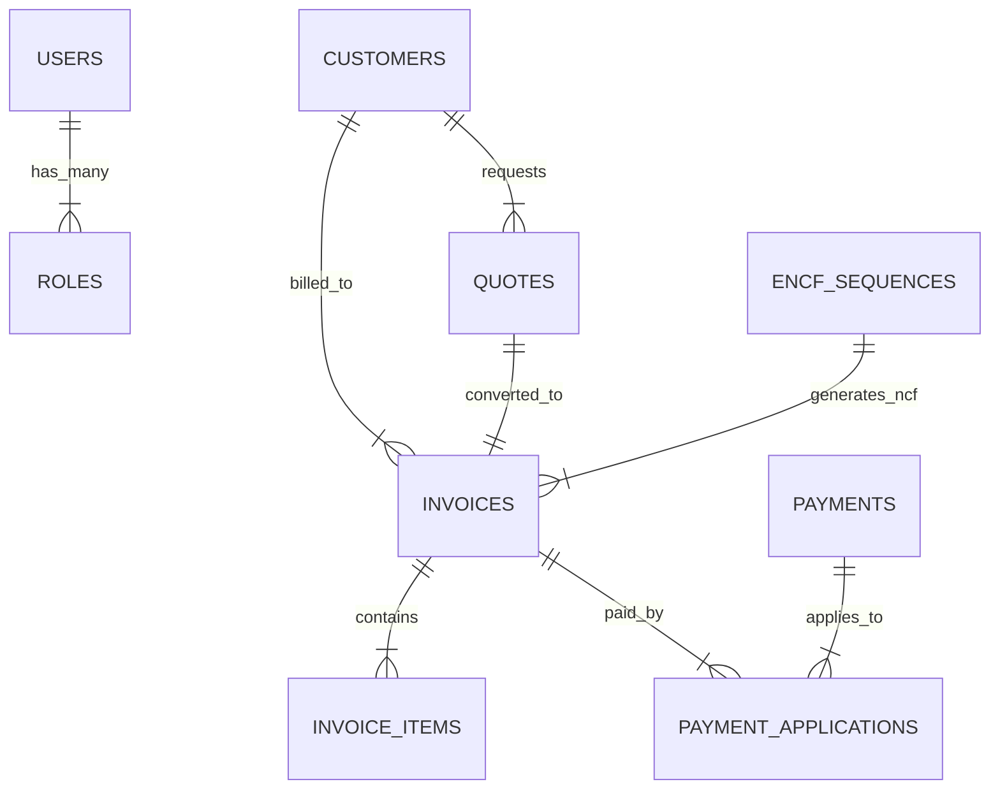

# 📘 ESTADO TÉCNICO DETALLADO: Backend Core (Fases 1-8)

**Fecha de Corte:** 14 de enero de 2026
**Estado:** Backend Core Funcional (Base de Datos + Entidades + Lógica Transaccional)

---

## 1. Arquitectura de Datos (Supabase / PostgreSQL)

Hemos implementado un modelo relacional robusto con 5 esquemas principales interconectados.

### 🏛️ ERD Conceptual



### 📋 Implementación Física (Tablas)

#### 1.1 Identity Schema
- `users`: Autenticación y perfil.
- `roles`, `permissions`, `user_roles`: RBAC completo.

#### 1.2 Master Data Schema
- `customers`: Validación estricta de RNC/Cédula (`CONSTRAINT valid_rnc`).
- `service_items`: Catálogo de productos y servicios con `tax_rate`.
- `price_lists`: Listas de precios personalizadas.

#### 1.3 Quotation Schema
- `quotes`: Estados (`DRAFT`, `SENT`, `APPROVED`).
- `quote_items`: Detalles con cálculo de impuestos.

#### 1.4 Billing & e-NCF Schema (CRÍTICO)
- `invoices`: Tabla central de facturación.
- `encf_sequences`: Control de concurrencia y secuencias autorizadas por DGII.
  - **Función Clave:** `get_next_ncf(p_type)`
  - **Propiedad:** ATOMICITY (Usa `FOR UPDATE` para bloqueo de fila).

#### 1.5 Accounts Receivable Schema
- `payments`: Registro de ingresos (Caja).
- `payment_applications`: Tabla pivote de muchos a muchos con metadata.
  - **Función Clave:** `apply_payment(payment_id, invoice_id, amount)`
  - **Propiedad:** TRANSACTIONAL (Actualiza saldo de factura y remanente de pago en una sola transacción).

---

## 2. Microservicios Implementados (Hexagonal Architecture)

Cada servicio sigue estrictamente la estructura Ports & Adapters.

### 🟡 Identity Service (Completo)
- **Path:** `services/identity-service`
- **Adapters:** REST Controllers (`/auth/login`), Supabase Repo, RabbitMQ Publisher.

### 🟢 Master Data Service (Base)
- **Path:** `services/master-data-service`
- **Domain:** `Customer`, `ServiceItem`.
- **Logic:** Reglas de validación de crédito y documentos fiscales.

### 🔵 Quotation Service (Base)
- **Path:** `services/quotation-service`
- **Domain:** `Quote`, `QuoteItem`.
- **Logic:** Conversión de items a líneas de cotización, cálculo de subtotales.

### 🔴 Billing Service (Base)
- **Path:** `services/billing-service`
- **Domain:** `Invoice`, `eNCF`.
- **Logic:** Generación de NCF (B01, B02...) mediante RPC a base de datos.

### 🟣 AR Service (Base)
- **Path:** `services/ar-service`
- **Domain:** `Payment`.
- **Logic:** Aplicación de pagos mediante Stored Procedure RPC.

### ⚫ Notification Service (Base)
- **Path:** `services/notification-service`
- **Adapters:** `MailpitEmailSender` (Mock para desarrollo).

---

## 3. Flujos de Negocio Soportados

### Flujo 1: Venta a Crédito
1.  **Identity:** Login de usuario (Admin).
2.  **Master Data:** Crear cliente `Empresa Demo` (RNC validado).
3.  **Quotation:** Crear cotización #1001.
4.  **Billing:** Convertir #1001 a Factura.
    - Se llama a `get_next_ncf('31')`.
    - Se asigna NCF `E3100000001`.
    - Factura nace con saldo = total.
5.  **AR:** Recibir pago parcial.
    - Se llama a `apply_payment()`.
    - Factura pasa a estado `PARTIALLY_PAID`.

---

## 4. Referencias de Código Clave

### Generación Atómica de NCF
Ubicación: `supabase/migrations/20260114000004_create_billing_schema.sql`

```sql
SELECT * INTO seq_record 
FROM encf_sequences 
WHERE ncf_type = p_type FOR UPDATE;
-- Garantiza que dos facturas concurrentes no obtengan el mismo NCF
```

### Aplicación Transaccional de Pagos
Ubicación: `supabase/migrations/20260114000005_create_ar_schema.sql`

```sql
-- Verifica saldos, inserta aplicación y actualiza dos tablas
-- Todo o nada (ACID)
UPDATE payments ...
UPDATE invoices ...
```

---

## 5. Próximos Pasos Técnicos

1.  **Exponer APIs:** Crear los `Controller` (NestJS) para MasterData, Billing y AR.
2.  **Conectar Notification:** Suscribir el servicio a colas RabbitMQ (`invoice.issued`).
3.  **Frontend:** Construir UI consumiendo estas nuevas APIs.

---

**Documento generado automáticamente por Antigravity.**
