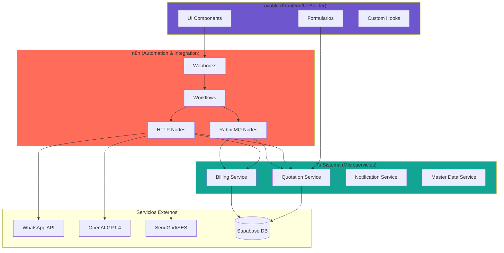

# Guía Completa: Integración n8n + Lovable + Sistema de Facturación

## 📋 Índice
1. [Arquitectura de Integración](#arquitectura)
2. [Configuración de n8n](#configuracion-n8n)
3. [Workflows de n8n Recomendados](#workflows)
4. [Integración con Lovable](#lovable)
5. [APIs y Endpoints](#apis)
6. [Ejemplos Prácticos](#ejemplos)

---

## 🏗️ Arquitectura de Integración {#arquitectura}



---

## ⚙️ Configuración de n8n {#configuracion-n8n}

### Paso 1: Instalar n8n con Docker

```bash
# Crear directorio para n8n
mkdir -p c:/Users/wilbe/Downloads/TESISFACTURACION/n8n-data

# Ejecutar n8n
docker run -d \
  --name n8n-alito \
  -p 5678:5678 \
  -e N8N_HOST=localhost \
  -e N8N_PORT=5678 \
  -e N8N_BASIC_AUTH_ACTIVE=true \
  -e N8N_BASIC_AUTH_USER=admin \
  -e N8N_BASIC_AUTH_PASSWORD=alito_n8n_2026 \
  -e WEBHOOK_URL=http://localhost:5678/ \
  -v c:/Users/wilbe/Downloads/TESISFACTURACION/n8n-data:/home/node/.n8n \
  --network alito-network \
  n8nio/n8n
```

### Paso 2: Acceder a n8n

```
URL: http://localhost:5678
Usuario: admin
Password: alito_n8n_2026
```

### Paso 3: Configurar Credenciales

En n8n, ve a **Settings → Credentials** y agrega:

#### ✅ **Supabase Credentials**
```json
{
  "host": "127.0.0.1",
  "port": 54322,
  "database": "postgres",
  "user": "postgres",
  "password": "postgres",
  "ssl": false
}
```

#### ✅ **RabbitMQ Credentials**
```json
{
  "hostname": "localhost",
  "port": 5672,
  "username": "alito",
  "password": "alito_dev_2026",
  "vhost": "/"
}
```

#### ✅ **OpenAI Credentials**
```json
{
  "apiKey": "sk-YOUR_OPENAI_KEY"
}
```

#### ✅ **WhatsApp Business (Meta) Credentials**
```json
{
  "accessToken": "YOUR_META_ACCESS_TOKEN",
  "phoneNumberId": "YOUR_PHONE_NUMBER_ID"
}
```

---

## 🔄 Workflows de n8n Recomendados {#workflows}

### Workflow 1: Notificación de Cotización Aprobada

**Nombre:** `quote-approved-notification`

**Trigger:** RabbitMQ Message Received

```json
{
  "nodes": [
    {
      "parameters": {
        "queue": "n8n.notifications",
        "options": {}
      },
      "name": "RabbitMQ Trigger",
      "type": "n8n-nodes-base.rabbitmqTrigger",
      "position": [250, 300]
    },
    {
      "parameters": {
        "conditions": {
          "string": [
            {
              "value1": "={{$json.event}}",
              "value2": "QuoteApproved"
            }
          ]
        }
      },
      "name": "Is QuoteApproved?",
      "type": "n8n-nodes-base.if",
      "position": [450, 300]
    },
    {
      "parameters": {
        "url": "http://localhost:3002/api/master-data/v1/customers/={{$json.customerId}}",
        "options": {}
      },
      "name": "Get Customer",
      "type": "n8n-nodes-base.httpRequest",
      "position": [650, 250]
    },
    {
      "parameters": {
        "url": "http://localhost:3003/api/quotation/v1/quotes/={{$json.quoteId}}",
        "options": {}
      },
      "name": "Get Quote",
      "type": "n8n-nodes-base.httpRequest",
      "position": [650, 350]
    },
    {
      "parameters": {
        "to": "={{$node[\"Get Customer\"].json.phone}}",
        "template": "quote_approved",
        "components": {
          "body": [
            {
              "type": "text",
              "text": "¡Hola {{$node[\"Get Customer\"].json.name}}! Tu cotización #{{$json.quoteNumber}} ha sido aprobada. Total: RD${{$node[\"Get Quote\"].json.total}}"
            }
          ]
        }
      },
      "name": "Send WhatsApp",
      "type": "n8n-nodes-base.whatsApp",
      "position": [850, 300]
    }
  ],
  "connections": {
    "RabbitMQ Trigger": {
      "main": [[{"node": "Is QuoteApproved?", "type": "main", "index": 0}]]
    },
    "Is QuoteApproved?": {
      "main": [
        [
          {"node": "Get Customer", "type": "main", "index": 0},
          {"node": "Get Quote", "type": "main", "index": 0}
        ]
      ]
    },
    "Get Customer": {
      "main": [[{"node": "Send WhatsApp", "type": "main", "index": 0}]]
    }
  }
}
```

**Cómo Activarlo:**
1. Crear nuevo workflow en n8n
2. Importar el JSON de arriba
3. Configurar credenciales de RabbitMQ y WhatsApp
4. Activar el workflow

---

### Workflow 2: Procesamiento de WhatsApp con IA

**Nombre:** `whatsapp-ai-processor`

**Descripción:** Recibe mensajes de WhatsApp, usa GPT-4 para extraer datos, y crea cotización.

#### Configuración del Workflow:

```javascript
// Nodo 1: Webhook Trigger
{
  "httpMethod": "POST",
  "path": "whatsapp-incoming",
  "responseMode": "lastNode"
}

// Nodo 2: Extract Message Data
const from = $input.item.json.entry[0].changes[0].value.messages[0].from;
const text = $input.item.json.entry[0].changes[0].value.messages[0].text.body;

return {
  from: from,
  text: text,
  timestamp: new Date().toISOString()
};

// Nodo 3: GPT-4 Extraction
{
  "model": "gpt-4-turbo",
  "messages": [
    {
      "role": "system",
      "content": "Eres un asistente que extrae datos de solicitudes de cotización en español dominicano. Retorna JSON con: customerName, items (array con description, quantity, unit), location."
    },
    {
      "role": "user",
      "content": "={{$json.text}}"
    }
  ],
  "temperature": 0.3
}

// Nodo 4: Create Quote Draft
{
  "url": "http://localhost:3003/api/quotation/v1/manual",
  "method": "POST",
  "body": {
    "customerRnc": "{{$json.rnc || 'PENDING'}}",
    "customerName": "={{$node['GPT-4 Extraction'].json.customerName}}",
    "projectName": "WhatsApp Request",
    "location": "={{$node['GPT-4 Extraction'].json.location}}",
    "items": "={{$node['GPT-4 Extraction'].json.items}}",
    "notes": "Creado vía WhatsApp IA - Validar datos"
  },
  "authentication": "headerAuth",
  "headerAuthCredentials": "quotation-api-key"
}

// Nodo 5: Send Confirmation
{
  "to": "={{$node['Extract Message Data'].json.from}}",
  "body": "✅ ¡Solicitud recibida!\n\nCotización #{{$json.quoteId}} creada.\n\nUn asesor te contactará pronto.\n\n—ALITO GROUP SRL"
}
```

**URL del Webhook:** `http://localhost:5678/webhook/whatsapp-incoming`

**Configurar en Meta:**
1. Ve a **Meta Business Suite → WhatsApp → Settings**
2. Configura Webhook URL: `https://your-domain.com/webhook/whatsapp-incoming`
3. Verify Token: `alito_whatsapp_2026`

---

### Workflow 3: Recordatorio de Pagos Vencidos

**Nombre:** `payment-reminders-daily`

**Trigger:** Cron (Todos los días a las 9:00 AM)

```javascript
// Nodo 1: Schedule Trigger
{
  "mode": "everyDay",
  "hour": 9,
  "minute": 0
}

// Nodo 2: Query Overdue Invoices (Supabase)
{
  "operation": "executeQuery",
  "query": `
    SELECT 
      i.id,
      i.invoice_number,
      i.total,
      i.due_date,
      c.name as customer_name,
      c.phone as customer_phone
    FROM invoices i
    JOIN customers c ON i.customer_id = c.id
    WHERE i.status = 'pending'
      AND i.due_date < CURRENT_DATE
      AND NOT EXISTS (
        SELECT 1 FROM notifications 
        WHERE invoice_id = i.id 
          AND type = 'payment_reminder'
          AND sent_at > CURRENT_DATE - INTERVAL '3 days'
      )
  `
}

// Nodo 3: Loop Over Invoices
// (Item Lists node)

// Nodo 4: Send WhatsApp Reminder
{
  "to": "={{$json.customer_phone}}",
  "body": `⚠️ Recordatorio de Pago

Estimado/a {{$json.customer_name}},

La factura {{$json.invoice_number}} tiene un saldo pendiente:

💰 Monto: RD$ {{$json.total}}
📅 Vencimiento: {{$json.due_date}}

Por favor, realiza tu pago a la brevedad.

—ALITO GROUP SRL
📞 809-XXX-XXXX`
}

// Nodo 5: Log Notification Sent (Supabase)
{
  "operation": "insert",
  "table": "notifications",
  "columns": {
    "invoice_id": "={{$json.id}}",
    "type": "payment_reminder",
    "channel": "whatsapp",
    "sent_at": "={{new Date().toISOString()}}",
    "status": "sent"
  }
}
```

---

## 💜 Integración con Lovable {#lovable}

### Opción A: Webhook desde Lovable a n8n

En tu proyecto **Lovable**, crea un hook personalizado:

```typescript
// src/hooks/useN8NIntegration.ts
import { useState } from 'react';

const N8N_WEBHOOK_BASE = 'http://localhost:5678/webhook';

export const useN8NIntegration = () => {
  const [loading, setLoading] = useState(false);

  const sendToN8N = async (workflowPath: string, data: any) => {
    setLoading(true);
    try {
      const response = await fetch(`${N8N_WEBHOOK_BASE}/${workflowPath}`, {
        method: 'POST',
        headers: { 'Content-Type': 'application/json' },
        body: JSON.stringify(data)
      });
      return await response.json();
    } catch (error) {
      console.error('n8n Error:', error);
      throw error;
    } finally {
      setLoading(false);
    }
  };

  return { sendToN8N, loading };
};
```

**Uso en Componente:**

```tsx
// src/components/QuoteRequestForm.tsx
import { useN8NIntegration } from '@/hooks/useN8NIntegration';

export default function QuoteRequestForm() {
  const { sendToN8N, loading } = useN8NIntegration();

  const handleSubmit = async (formData) => {
    try {
      // Enviar a n8n en lugar de directamente al backend
      const result = await sendToN8N('process-quote-request', {
        customerName: formData.name,
        items: formData.items,
        location: formData.location,
        source: 'lovable-web-form'
      });

      alert(`Cotización creada: ${result.quoteId}`);
    } catch (error) {
      alert('Error al procesar solicitud');
    }
  };

  return (
    <form onSubmit={handleSubmit}>
      {/* Form fields */}
      <button type="submit" disabled={loading}>
        {loading ? 'Procesando...' : 'Solicitar Cotización'}
      </button>
    </form>
  );
}
```

---

### Opción B: Llamada Directa a APIs (Sin n8n)

```typescript
// src/lib/apiClient.ts
const API_BASE = 'http://localhost:3003/api/quotation/v1';

export const quotationAPI = {
  createQuote: async (data: CreateQuoteDTO) => {
    const response = await fetch(`${API_BASE}/manual`, {
      method: 'POST',
      headers: { 
        'Content-Type': 'application/json',
        'Authorization': `Bearer ${localStorage.getItem('token')}`
      },
      body: JSON.stringify(data)
    });
    return response.json();
  },

  getProformas: async () => {
    const response = await fetch(`${API_BASE}/proformas`);
    return response.json();
  },

  downloadProformaPDF: async (id: string) => {
    const response = await fetch(`${API_BASE}/proformas/${id}/pdf`);
    const data = await response.json();
    window.open(data.pdfUrl, '_blank');
  }
};
```

**Uso:**

```tsx
import { quotationAPI } from '@/lib/apiClient';

const CreateQuotePage = () => {
  const handleCreate = async () => {
    const quote = await quotationAPI.createQuote({
      customerRnc: '101-90213-7',
      customerName: 'DOLFOS SRL',
      projectName: 'Proyecto X',
      location: 'Santo Domingo',
      items: [
        {
          serviceId: 'srv-001',
          description: 'Grúa 20 Ton',
          quantity: 4,
          unit: 'HR',
          unitPrice: 3500
        }
      ]
    });
    
    console.log('Quote created:', quote);
  };

  return <button onClick={handleCreate}>Crear Cotización</button>;
};
```

---

## 🔌 APIs y Endpoints Disponibles {#apis}

### Quotation Service

```typescript
// GET /api/quotation/v1/quotes
// Lista todas las cotizaciones

// POST /api/quotation/v1/manual
// Crear cotización manual
{
  "customerRnc": "101-90213-7",
  "customerName": "DOLFOS SRL",
  "projectName": "CARLTON #7",
  "location": "Santo Domingo",
  "items": [
    {
      "serviceId": "srv-001",
      "description": "Transporte",
      "quantity": 1,
      "unit": "VIAJE",
      "unitPrice": 5000
    }
  ],
  "notes": "Urgente"
}

// GET /api/quotation/v1/proformas
// Lista proformas

// GET /api/quotation/v1/proformas/:id/pdf
// Obtener URL del PDF
{
  "pdfUrl": "https://storage.supabase.co/..."
}

// POST /api/quotation/v1/webhook/whatsapp
// Webhook WhatsApp (Meta)
{
  "entry": [{
    "changes": [{
      "value": {
        "messages": [{
          "from": "+18091234567",
          "text": { "body": "Necesito 50 M3 calicote" }
        }]
      }
    }]
  }]
}
```

### Billing Service

```typescript
// GET /api/billing/v1/invoices
// Lista facturas

// POST /api/billing/v1/invoices
// Emitir factura
{
  "proformaId": "prof-123",
  "ncfType": "31"
}
```

### Master Data Service

```typescript
// GET /api/master-data/v1/customers
// Lista clientes

// GET /api/master-data/v1/service-items
// Lista servicios disponibles
```

---

## 🎯 Ejemplos Prácticos {#ejemplos}

### Ejemplo 1: Formulario Lovable → n8n → Quotation Service

**En Lovable:**

```tsx
const QuoteForm = () => {
  const { sendToN8N } = useN8NIntegration();

  return (
    <form onSubmit={async (e) => {
      e.preventDefault();
      const formData = new FormData(e.target);
      
      await sendToN8N('create-quote-with-ai', {
        customerName: formData.get('name'),
        description: formData.get('description'),
        location: formData.get('location')
      });
    }}>
      <input name="name" placeholder="Nombre del cliente" />
      <textarea name="description" placeholder="Describe lo que necesitas" />
      <input name="location" placeholder="Ubicación" />
      <button type="submit">Enviar Solicitud</button>
    </form>
  );
};
```

**Workflow n8n** (`create-quote-with-ai`):
1. Webhook recibe data
2. GPT-4 extrae items de `description`
3. Busca cliente en Master Data
4. Crea cotización en Quotation Service
5. Envía confirmación WhatsApp
6. Retorna `quoteId` a Lovable

---

### Ejemplo 2: Dashboard Lovable Consumiendo APIs

```tsx
// src/pages/Dashboard.tsx
import { useEffect, useState } from 'react';
import { quotationAPI } from '@/lib/apiClient';

export default function Dashboard() {
  const [proformas, setProformas] = useState([]);

  useEffect(() => {
    quotationAPI.getProformas().then(setProformas);
  }, []);

  return (
    <div>
      <h1>Proformas Pendientes</h1>
      {proformas.map(p => (
        <div key={p.id}>
          <h3>{p.customerName}</h3>
          <p>Total: RD$ {p.total}</p>
          <button onClick={() => quotationAPI.downloadProformaPDF(p.id)}>
            Descargar PDF
          </button>
        </div>
      ))}
    </div>
  );
}
```

---

## 🚀 Siguiente Paso: Implementación

### Checklist de Implementación

- [ ] **Instalar n8n** (Docker)
- [ ] **Configurar credenciales** (Supabase, RabbitMQ, WhatsApp, OpenAI)
- [ ] **Crear Workflow 1:** Notificaciones de Cotización
- [ ] **Crear Workflow 2:** WhatsApp + IA
- [ ] **Crear Workflow 3:** Recordatorios de Pago
- [ ] **En Lovable:** Hook `useN8NIntegration`
- [ ] **En Lovable:** Cliente API directo
- [ ] **Probar integración** end-to-end

---

## 📞 Soporte

Si necesitas ayuda:
1. Revisa logs de n8n: `docker logs n8n-alito`
2. Verifica conectividad: `curl http://localhost:5678/webhook/test`
3. Consulta documentación n8n: https://docs.n8n.io

**¡Listo para automatizar!** 🎉
