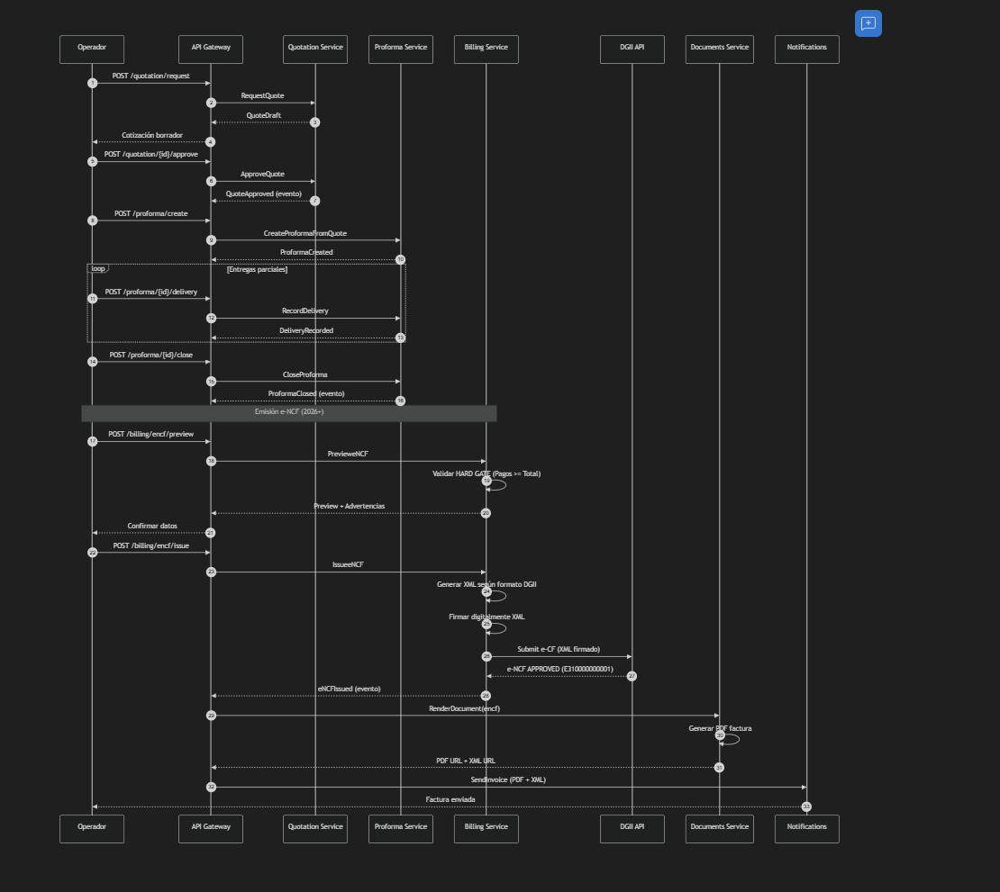

# Plan de Implementación - Sistema de Facturación Cloud

## Arquitectura de Microservicios + Hexagonal + APIs REST + e-NCF DGII

---

## Descripción del Objetivo

Implementar un **Sistema de Facturación Cloud con IA** para ALITO GROUP SRL basado en **arquitectura de microservicios** con:

✅ **Arquitectura Hexagonal** por cada microservicio
✅ **Supabase** como backend (PostgreSQL + PostgREST + Auth + Storage + Realtime)
✅ **API REST documentada** (Swagger/OpenAPI) por cada microservicio
✅ **Soporte e-NCF** (Comprobante Fiscal Electrónico) según normativas DGII 2026
✅ **Firma Digital** y generación XML formato DGII
✅ **Formatos de documentos** basados en plantillas reales de ALITO GROUP

---

## 📋 Análisis de Documentos Actuales (Imágenes Proporcionadas)

### Documento 1: Cotización T507

Review

Cotización T507

**Estructura identificada:**

* **RNC:** 133-28669-2
* **Cliente:** DOLFOS S.R.L (RNC: 101-90213-7)
* **Ubicación:** CARLTON #7 (12 de octubre de 2026)
* **Items:**
  * Transporte de cajón
  * Relleno/Lastre compactador (2,549.745M3 × $800.00)
  * Alquiler de equipo (combo)
* **Cálculos:**
  * Total EXC: $2,083,796.00
  * Total Grav: $382,861.75
  * Total C/ITBIS (18%): $2,466,657.75
  * Total C/DESC: $2,466,253.75
  * **TOTAL RD$: 2,535,180.87**

### Documento 2: Proforma 02-017

Review

Proforma 02-017

**Estructura identificada:**

* **Cliente:** REQUIXES SRL (RNC: 132-88523-8, Contacto: DAVID 14)
* **Fecha:** 12-ago-26, LA ALTAGRACIA
* **Items con fechas de ejecución:**
  * No. Control, Fecha real, Equipo, Descripción, Cantidad, UD, P.U., Total
  * Ejemplo: MINICARGADOR TRANSPORTE (1.00 P/A × $6,000.00 = $6,000.00)
* **Totales:**
  * TOTAL EXC: $17,000.00
  * TOTAL GRAV: $42,000.00
  * TOTAL EXC + GRAV: $59,000.00
  * ITBIS 18%: $7,560.00
  * **TOTAL GENERAL RD$: 66,560.00**

### Documento 3: Factura Fiscal (NCF: B9100001852)

Review

Factura B9100001852

**Estructura identificada:**

* **NCF:** B9100001852 (Factura de Crédito Fiscal)
* **Vigencia:** Hasta 31/12/2026
* **RNC:** 133-20669-2
* **Fecha:** 13 de enero de 2026
* **Cliente:** REICHH INVESTMENT DEVELOPERS SRL (RNC: 131-15047-2)
* **Ubicación:** VILLA BERNARDO
* **Items:**
  * Cantidad: 64.00 M3
  * Descripción: SUMINISTRO DE CALICOTE
  * Precio Unitario: $900.00
  * Total: $57,600.00
* **Cálculos:**
  * VALOR EXCENTO: $57,600.00
  * SUB-TOTAL: $57,600.00
  * ITBIS 18%: $- (Excento)
  * **TOTAL RD$: 57,600.00**
* **Autorizado por:** AURDEALBSA, Gerente General
* **Recibido por / Realizado por:** Firmas físicas

---

## 🚨 Requisitos e-NCF DGII (Normativa 2026)

### Obligatoriedad

CAUTION

**Fecha límite:** 15 de mayo de 2026
Todas las empresas en República Dominicana deben emitir  **Comprobantes Fiscales Electrónicos (e-NCF)** .

### Requisitos Técnicos para e-NCF

1. **Certificado Digital DGII**
   * Emisor debe tener certificado digital para procesos tributarios
   * Emitido por la DGII
2. **Formato XML Estandarizado**
   * Versión 1.0 del esquema DGII
   * Firmado digitalmente
3. **Tipos de e-CF Soportados**
   * **e-CF 31:** Factura de Crédito Fiscal Electrónica
   * **e-CF 32:** Factura de Consumo Electrónica
   * **e-CF 33:** Nota de Débito Electrónica
   * **e-CF 34:** Nota de Crédito Electrónica
   * **e-CF 41:** Comprobante de Compras
   * **e-CF 43:** Gastos Menores
   * **e-CF 46:** Exportaciones
4. **Estructura XML (Secciones Principales)**
   <pre>

<eCF>

<Encabezado>

<IdDoc>

<TipoeCF>31</TipoeCF><!-- e-CF 31: Factura Crédito Fiscal -->

<eNCF>E310000000001</eNCF><!-- e-NCF asignado -->

<FechaEmision>2026-01-14</FechaEmision>

</IdDoc>

<Emisor>

<RNCEmisor>133206692</RNCEmisor>

<RazonSocialEmisor>ALITO GROUP SRL</RazonSocialEmisor>

</Emisor>

<Comprador>

<RNCComprador>131150472</RNCComprador>

<RazonSocialComprador>REICHH INVESTMENT DEVELOPERS SRL</RazonSocialComprador>

</Comprador>

<Totales>

<MontoTotal>57600.00</MontoTotal>

<MontoGravadoTotal>0.00</MontoGravadoTotal>

<MontoExento>57600.00</MontoExento>

<ITBIS>0.00</ITBIS>

</Totales>

</Encabezado>

<DetallesItems>

<Item>

<NumeroLinea>1</NumeroLinea>

<CantidadItem>64.00</CantidadItem>

<UnidadMedida>M3</UnidadMedida>

<DescripcionItem>SUMINISTRO DE CALICOTE</DescripcionItem>

<PrecioUnitarioItem>900.00</PrecioUnitarioItem>

<MontoItem>57600.00</MontoItem>

</Item>

</DetallesItems>

<FirmaDigital>

<!-- Firma XML según estándar XMLDSig -->

</FirmaDigital>

</eCF>

</pre>
5. **Validaciones DGII**
   * Catálogo oficial de unidades de medida
   * Catálogo oficial de monedas
   * Códigos de impuestos y tasas
   * Formas de pago

---

## Requiere Revisión del Usuario

IMPORTANT

**Cambios Críticos en el Plan**

1. **API REST documentada por cada microservicio:**
   * Swagger/OpenAPI 3.0
   * Generación automática de documentación interactiva
   * Endpoints RESTful + versionado
2. **Soporte e-NCF (nuevo):**
   * Generación XML según formato DGII
   * Firma digital con certificado DGII
   * Validación contra catálogos oficiales
   * Envío a API DGII para aprobación
3. **Compatibilidad NCF tradicionales + e-NCF:**
   * Hasta mayo 2026: NCF tradicionales (B01, B02, etc.)
   * Después de mayo 2026: Solo e-NCF (e-CF 31, e-CF 32, etc.)

WARNING

**e-NCF requiere integración con API DGII:**

* Autenticación con certificado digital
* Envío de XML firmado
* Recepción de respuesta (aprobado/rechazado)
* Almacenamiento de respuesta DGII (auditoría)

---

## Cambios Propuestos

### 🌐 Infraestructura Base (Con Supabase Local)

NOTE

**Supabase Local** nos proporciona:

* ✅ **PostgreSQL 17** (base de datos)
* ✅ **PostgREST** (API REST automática desde tablas)
* ✅ **GoTrue** (Authentication con JWT)
* ✅ **Storage API** (almacenamiento de PDFs/documentos)
* ✅ **Realtime** (subscripciones WebSocket)
* ✅ **Supabase Studio** (UI web de administración)
* ✅ **Edge Functions** (funciones serverless Deno)

#### [NUEVO] Configuración Supabase

Supabase se inicia con:

<pre>

supabaseinit# Ya ejecutado

supabasestart# Inicia todos los servicios

</pre>

**Puertos asignados:**

* PostgreSQL: `54322`
* PostgREST API: `54321`
* Supabase Studio: `http://127.0.0.1:54323`
* Inbucket (email testing): `54324`

#### Estrategia de APIs: PostgREST + Swagger

TIP

**Usamos AMBOS: PostgREST (Supabase) + Swagger (Custom)**

**PostgREST (automático desde Supabase):**

* Operaciones CRUD simples en tablas
* Consultas rápidas sin escribir código
* Ideal para: Master Data (clientes, servicios, precios)
* URL: `http://localhost:54321/rest/v1/[tabla]`

**Swagger/OpenAPI (nuestros microservicios):**

* Lógica de negocio compleja (cotizaciones, facturación)
* Reglas de validación (HARD GATES, NCF)
* Flujos multi-paso (Preview → Issue)
* Integración e-NCF DGII

**Ejemplo:**

* `GET /rest/v1/customers` → PostgREST (listar clientes)
* `POST /api/quotation/v1/manual` → Swagger (crear cotización con validaciones)

#### [NUEVO]

docker-compose.yml

IMPORTANT

Este `docker-compose.yml` es **complementario** a Supabase.
Supabase ya provee PostgreSQL, Auth y Storage.
Solo necesitamos agregar: RabbitMQ, Redis, Kong y Observabilidad.

<pre>

version: '3.8'

# Este docker-compose es COMPLEMENTARIO a Supabase

# Supabase ya provee: PostgreSQL, PostgREST, Auth, Storage, Realtime

# Aquí agregamos: RabbitMQ, Redis, API Gateway, Observabilidad

services:

# Event Bus (RabbitMQ)

rabbitmq:

image: rabbitmq:3.12-management-alpine

ports:

      - "5672:5672"

      - "15672:15672"

environment:

RABBITMQ_DEFAULT_USER: alito

RABBITMQ_DEFAULT_PASS: ${RABBITMQ_PASSWORD}

volumes:

      - rabbitmq-data:/var/lib/rabbitmq

networks:

      - alito-network

# Redis (Cache + Sessions)

redis:

image: redis:7-alpine

ports:

      - "6379:6379"

volumes:

      - redis-data:/data

networks:

      - alito-network

# API Gateway (Kong)

kong:

image: kong:3.4-alpine

environment:

KONG_DATABASE: "off"

KONG_DECLARATIVE_CONFIG: /kong/declarative/kong.yml

KONG_PROXY_ACCESS_LOG: /dev/stdout

KONG_ADMIN_ACCESS_LOG: /dev/stdout

KONG_PROXY_ERROR_LOG: /dev/stderr

KONG_ADMIN_ERROR_LOG: /dev/stderr

volumes:

      - ./infrastructure/api-gateway/kong.yml:/kong/declarative/kong.yml

ports:

      - "8000:8000"# Proxy HTTP

      - "8443:8443"# Proxy HTTPS

      - "8001:8001"# Admin API

networks:

      - alito-network

# Observabilidad

prometheus:

image: prom/prometheus:latest

volumes:

      - ./infrastructure/observability/prometheus.yml:/etc/prometheus/prometheus.yml

      - prometheus-data:/prometheus

ports:

      - "9090:9090"

networks:

      - alito-network

grafana:

image: grafana/grafana:latest

ports:

      - "3001:3000"

volumes:

      - grafana-data:/var/lib/grafana

networks:

      - alito-network

jaeger:

image: jaegertracing/all-in-one:latest

ports:

      - "5775:5775/udp"

      - "6831:6831/udp"

      - "6832:6832/udp"

      - "5778:5778"

      - "16686:16686"# UI

      - "14268:14268"

      - "14250:14250"

      - "9411:9411"

networks:

      - alito-network

volumes:

identity-data:

masterdata-data:

# ... (volúmenes para cada DB)

rabbitmq-data:

redis-data:

prometheus-data:

grafana-data:

networks:

alito-network:

driver: bridge

</pre>

---

### 🔐 Microservicio 1: Identity & Access (Actualizado con API REST)

#### [NUEVO]

services/identity/

**Estructura hexagonal + API REST:**

<pre>

services/identity/

├── src/

│   ├── domain/

│   │   ├── entities/

│   │   │   ├── User.ts

│   │   │   ├── Role.ts

│   │   │   └── Permission.ts

│   │   ├── ports/

│   │   │   ├── inbound/

│   │   │   │   ├── AuthenticatePort.ts

│   │   │   │   └── ManageUsersPort.ts

│   │   │   └── outbound/

│   │   │       ├── UserRepositoryPort.ts

│   │   │       └── AuditLogPort.ts

│   │   └── rules/

│   │       └── RBACRule.ts

│   ├── application/

│   │   ├── services/

│   │   │   └── AuthenticationService.ts

│   │   └── use-cases/

│   │       ├── LoginUseCase.ts

│   │       └── AssignRoleUseCase.ts

│   ├── adapters/

│   │   ├── inbound/

│   │   │   └── http/

│   │   │       ├── AuthController.ts

│   │   │       ├── UserController.ts

│   │   │       └── swagger.config.ts  ← NUEVO: Configuración Swagger

│   │   └── outbound/

│   │       ├── persistence/

│   │       │   ├── SupabaseUserRepository.ts  ← PRINCIPAL: Usa Supabase Client

│   │       │   └── PostgresUserRepository.ts  ← ALTERNATIVA: Conexión directa si se necesita

│   │       └── events/

│   │           └── EventPublisher.ts

│   ├── infrastructure/

│   │   ├── config/

│   │   │   ├── database.config.ts

│   │   │   └── api.config.ts  ← NUEVO: Config API REST

│   │   └── main.ts

│   └── api-docs/  ← NUEVO: Documentación OpenAPI

│       ├── openapi.yaml

│       └── postman-collection.json

├── prisma/

│   └── schema.prisma

├── package.json

└── Dockerfile

</pre>

**API REST Endpoints (Swagger/OpenAPI):**

<pre>

// src/adapters/inbound/http/swagger.config.ts

importswaggerJsdocfrom'swagger-jsdoc';

constoptions= {

definition: {

openapi:'3.0.0',

info: {

title:'Identity & Access API',

version:'1.0.0',

description:'API de autenticación y autorización - ALITO GROUP',

contact: {

name:'ALITO GROUP SRL',

email:'dev@alitogroup.com'

      }

    },

servers: [

      {

url:'http://localhost:8000/api/identity/v1',

description:'Development server'

      },

      {

url:'https://api.alitogroup.com/identity/v1',

description:'Production server'

      }

    ],

components: {

securitySchemes: {

BearerAuth: {

type:'http',

scheme:'bearer',

bearerFormat:'JWT'

        }

      }

    }

  },

apis: ['./src/adapters/inbound/http/*.ts']

};

exportconstswaggerSpec=swaggerJsdoc(options);

</pre>

<pre>

// src/adapters/inbound/http/AuthController.ts

import { Router } from'express';

/**

 * @swagger

 * /auth/login:

 *   post:

 *     summary: Autenticación de usuario

 *     tags: [Authentication]

 *     requestBody:

 *       required: true

 *       content:

 *         application/json:

 *           schema:

 *             type: object

 *             properties:

 *               username:

 *                 type: string

 *                 example: "admin@alitogroup.com"

 *               password:

 *                 type: string

 *                 example: "secure_password"

 *     responses:

 *       200:

 *         description: Login exitoso

 *         content:

 *           application/json:

 *             schema:

 *               type: object

 *               properties:

 *                 accessToken:

 *                   type: string

 *                 refreshToken:

 *                   type: string

 *                 expiresIn:

 *                   type: number

 *       401:

 *         description: Credenciales inválidas

 */

router.post('/auth/login', loginHandler);

/**

 * @swagger

 * /users:

 *   post:

 *     summary: Crear nuevo usuario

 *     tags: [Users]

 *     security:

 *       - BearerAuth: []

 *     requestBody:

 *       required: true

 *       content:

 *         application/json:

 *           schema:

 *             $ref: '#/components/schemas/CreateUserDTO'

 *     responses:

 *       201:

 *         description: Usuario creado

 *       403:

 *         description: No autorizado

 */

router.post('/users', authorize(['admin']), createUserHandler);

</pre>

---

### 💰 Microservicio 5: Billing & Tax (CRÍTICO - Con e-NCF)

#### [NUEVO]

services/billing/

**Estructura actualizada con soporte e-NCF:**

<pre>

services/billing/

├── src/

│   ├── domain/

│   │   ├── aggregates/

│   │   │   ├── Invoice.ts

│   │   │   ├── NCFSequence.ts

│   │   │   └── eNCF.ts  ← NUEVO: Agregado e-NCF

│   │   ├── value-objects/

│   │   │   ├── NCF.ts

│   │   │   ├── TaxBreakdown.ts

│   │   │   └── DigitalSignature.ts  ← NUEVO

│   │   ├── ports/

│   │   │   ├── inbound/

│   │   │   │   ├── IssueInvoicePort.ts

│   │   │   │   └── IssueeNCFPort.ts  ← NUEVO

│   │   │   └── outbound/

│   │   │       ├── BillingRepositoryPort.ts

│   │   │       ├── DGIIServicePort.ts  ← NUEVO: Comunicación con DGII

│   │   │       └── DigitalSignaturePort.ts  ← NUEVO: Firma digital

│   │   └── rules/

│   │       ├── PaymentGateRule.ts

│   │       ├── NCFValidationRule.ts

│   │       └── eNCFValidationRule.ts  ← NUEVO

│   ├── application/

│   │   ├── services/

│   │   │   ├── BillingService.ts

│   │   │   └── eNCFService.ts  ← NUEVO

│   │   └── use-cases/

│   │       ├── IssueInvoiceUseCase.ts

│   │       ├── IssueeNCFUseCase.ts  ← NUEVO

│   │       └── PreviewInvoiceUseCase.ts

│   ├── adapters/

│   │   ├── inbound/

│   │   │   └── http/

│   │   │       ├── BillingController.ts

│   │   │       ├── eNCFController.ts  ← NUEVO

│   │   │       └── swagger.config.ts

│   │   └── outbound/

│   │       ├── persistence/

│   │       │   └── PostgresBillingRepository.ts

│   │       ├── events/

│   │       │   └── EventPublisher.ts

│   │       ├── dgii/

│   │       │   ├── DGIIApiClient.ts  ← NUEVO: Cliente API DGII

│   │       │   └── XMLGenerator.ts  ← NUEVO: Generador XML

│   │       └── signature/

│   │           └── DigitalSignatureService.ts  ← NUEVO

│   ├── infrastructure/

│   │   ├── config/

│   │   │   ├── dgii.config.ts  ← NUEVO

│   │   │   └── certificates/

│   │   │       └── dgii-cert.p12  ← Certificado digital DGII

│   │   └── templates/

│   │       ├── ecf-template.xml  ← Plantilla XML e-NCF

│   │       └── invoice-pdf.html

│   └── api-docs/

│       └── openapi.yaml

├── prisma/

│   └── schema.prisma

├── package.json

└── Dockerfile

</pre>

**Agregado e-NCF (Domain):**

<pre>

// src/domain/aggregates/eNCF.ts

import { DigitalSignature } from'../value-objects/DigitalSignature';

exportclasseNCF {

readonlyid:string;

readonlytype:eNCFType; // e-CF 31, 32, 33, etc.

readonlyencf:string; // E310000000001

readonlyemissionDate:Date;

readonlyemisor: {

rnc:string;

razonSocial:string;

direccion:string;

  };

readonlycomprador: {

rnc:string;

razonSocial:string;

  };

readonlyitems:eNCFItem[];

readonlytotales: {

montoTotal:number;

montoGravado:number;

montoExento:number;

itbis:number;

  };

readonlyxmlContent:string;

readonlydigitalSignature?:DigitalSignature;

readonlydgiiStatus:'pending'|'approved'|'rejected';

readonlydgiiResponse?:string;

// Regla: Solo se puede firmar si está validado

sign(signature:DigitalSignature):eNCF {

if (this.dgiiStatus!=='pending') {

thrownewError('eNCF ya procesado por DGII');

    }

returnneweNCF({

...this,

digitalSignature:signature

    });

  }

// Regla: Validar estructura antes de enviar

validate():ValidationResult {

// Validar contra catálogos DGII

// Validar totales

// Validar RNC

// etc.

  }

}

exportenumeNCFType {

FACTURA_CREDITO='e-CF 31',

FACTURA_CONSUMO='e-CF 32',

NOTA_DEBITO='e-CF 33',

NOTA_CREDITO='e-CF 34',

COMPRAS='e-CF 41',

GASTOS_MENORES='e-CF 43',

EXPORTACIONES='e-CF 46'

}

</pre>

**Generador XML DGII:**

<pre>

// src/adapters/outbound/dgii/XMLGenerator.ts

import { create } from'xmlbuilder2';

import { eNCF } from'../../../domain/aggregates/eNCF';

exportclassXMLGenerator {

generate(encf:eNCF):string {

constxml=create({ version:'1.0', encoding:'UTF-8' })

      .ele('eCF', { xmlns:'http://dgii.gov.do/ecf/v1.0' })

        .ele('Encabezado')

          .ele('IdDoc')

            .ele('TipoeCF').txt(this.mapTypeToCode(encf.type)).up()

            .ele('eNCF').txt(encf.encf).up()

            .ele('FechaEmision').txt(encf.emissionDate.toISOString().split('T')[0]).up()

            .ele('FechaVencimientoSecuencia').txt('2026-12-31').up()

          .up() // IdDoc

          .ele('Emisor')

            .ele('RNCEmisor').txt(encf.emisor.rnc.replace(/-/g, '')).up()

            .ele('RazonSocialEmisor').txt(encf.emisor.razonSocial).up()

            .ele('DireccionEmisor').txt(encf.emisor.direccion).up()

          .up() // Emisor

          .ele('Comprador')

            .ele('RNCComprador').txt(encf.comprador.rnc.replace(/-/g, '')).up()

            .ele('RazonSocialComprador').txt(encf.comprador.razonSocial).up()

          .up() // Comprador

          .ele('Totales')

            .ele('MontoTotal').txt(encf.totales.montoTotal.toFixed(2)).up()

            .ele('MontoGravadoTotal').txt(encf.totales.montoGravado.toFixed(2)).up()

            .ele('MontoExento').txt(encf.totales.montoExento.toFixed(2)).up()

            .ele('ITBIS').txt(encf.totales.itbis.toFixed(2)).up()

          .up() // Totales

        .up() // Encabezado

        .ele('DetallesItems');

// Agregar items

encf.items.forEach((item, index) => {

xml.ele('Item')

        .ele('NumeroLinea').txt((index+1).toString()).up()

        .ele('CantidadItem').txt(item.cantidad.toFixed(2)).up()

        .ele('UnidadMedida').txt(item.unidadMedida).up()

        .ele('DescripcionItem').txt(item.descripcion).up()

        .ele('PrecioUnitarioItem').txt(item.precioUnitario.toFixed(2)).up()

        .ele('MontoItem').txt(item.montoTotal.toFixed(2)).up()

      .up();

    });

returnxml.end({ prettyPrint:true });

  }

privatemapTypeToCode(type:eNCFType):string {

constmapping= {

[eNCFType.FACTURA_CREDITO]:'31',

[eNCFType.FACTURA_CONSUMO]:'32',

[eNCFType.NOTA_DEBITO]:'33',

[eNCFType.NOTA_CREDITO]:'34',

[eNCFType.COMPRAS]:'41',

[eNCFType.GASTOS_MENORES]:'43',

[eNCFType.EXPORTACIONES]:'46'

    };

returnmapping[type];

  }

}

</pre>

**Cliente API DGII:**

<pre>

// src/adapters/outbound/dgii/DGIIApiClient.ts

importaxiosfrom'axios';

import*asfsfrom'fs';

import*ashttpsfrom'https';

exportclassDGIIApiClient {

privatereadonlybaseUrl='https://ecf.dgii.gov.do/api/v1';

privatereadonlycertificatePath:string;

privatereadonlycertificatePassword:string;

constructor() {

this.certificatePath=process.env.DGII_CERT_PATH!;

this.certificatePassword=process.env.DGII_CERT_PASSWORD!;

  }

asyncsubmitECF(signedXML:string):Promise<DGIIResponse> {

try {

// Configurar cliente HTTPS con certificado

constpfx=fs.readFileSync(this.certificatePath);

consthttpsAgent=newhttps.Agent({

pfx:pfx,

passphrase:this.certificatePassword

      });

constresponse=awaitaxios.post(

`${this.baseUrl}/ecf/submit`,

        {

xmlContent:Buffer.from(signedXML).toString('base64')

        },

        {

httpsAgent,

headers: {

'Content-Type':'application/json',

'X-RNC-Emisor':'133206692'

          }

        }

      );

return {

success:response.data.status==='APPROVED',

encfApproved:response.data.encf,

message:response.data.message,

errors:response.data.errors|| []

      };

    } catch (error) {

thrownewDGIIError('Error al enviar e-CF a DGII', error);

    }

  }

asyncgetECFStatus(encf:string):Promise<DGIIStatusResponse> {

// Consultar estado de e-CF

  }

}

interfaceDGIIResponse {

success:boolean;

encfApproved:string;

message:string;

errors:string[];

}

</pre>

**API REST Endpoints (Billing + e-NCF):**

<pre>

// src/adapters/inbound/http/eNCFController.ts

/**

 * @swagger

 * /billing/encf/issue:

 *   post:

 *     summary: Emitir Comprobante Fiscal Electrónico (e-NCF)

 *     tags: [e-NCF]

 *     security:

 *       - BearerAuth: []

 *     requestBody:

 *       required: true

 *       content:

 *         application/json:

 *           schema:

 *             type: object

 *             properties:

 *               proformaId:

 *                 type: string

 *                 format: uuid

 *               type:

 *                 type: string

 *                 enum: ['e-CF 31', 'e-CF 32']

 *                 description: Tipo de e-NCF

 *     responses:

 *       201:

 *         description: e-NCF emitido exitosamente

 *         content:

 *           application/json:

 *             schema:

 *               type: object

 *               properties:

 *                 encf:

 *                   type: string

 *                   example: "E310000000001"

 *                 xmlUrl:

 *                   type: string

 *                 pdfUrl:

 *                   type: string

 *                 dgiiStatus:

 *                   type: string

 *                   enum: ['approved', 'rejected']

 *       400:

 *         description: Validación fallida (HARD GATE)

 *         content:

 *           application/json:

 *             schema:

 *               type: object

 *               properties:

 *                 error:

 *                   type: string

 *                   example: "PaymentRequiredError: Falta pagar $5000.00"

 *       403:

 *         description: No autorizado

 */

router.post('/billing/encf/issue', 

authorize(['billing:issue']), 

issueeNCFHandler

);

/**

 * @swagger

 * /billing/encf/{encf}/xml:

 *   get:

 *     summary: Descargar XML firmado del e-NCF

 *     tags: [e-NCF]

 *     security:

 *       - BearerAuth: []

 *     parameters:

 *       - in: path

 *         name: encf

 *         required: true

 *         schema:

 *           type: string

 *         description: Número e-NCF (ej. E310000000001)

 *     responses:

 *       200:

 *         description: XML del e-NCF

 *         content:

 *           application/xml:

 *             schema:

 *               type: string

 */

router.get('/billing/encf/:encf/xml', downloadXMLHandler);

</pre>

---

## 📄 Formatos de Documentos (Templates)

### Template: Cotización

<pre>

<!-- services/documents/templates/cotizacion.html -->

<!DOCTYPEhtml>

<html>

<head>

<metacharset="UTF-8">

<title>Cotización {{numero}}</title>

<style>

body { font-family: Arial, sans-serif; margin: 40px; }

.header { text-align: center; margin-bottom: 30px; }

.logo { width: 150px; }

.info-box { border: 2pxsolid#000; padding: 10px; margin: 20px0; }

table { width: 100%; border-collapse: collapse; }

th, td { border: 1pxsolid#000; padding: 8px; text-align: left; }

th { background-color: #FFD966; }

.totals { margin-top: 20px; text-align: right; }

.total-row { font-weight: bold; font-size: 1.2em; }

</style>

</head>

<body>

<divclass="header">

<imgsrc="{{logoUrl}}"class="logo"alt="ALITO GROUP">

<h2>RNC: 133-28669-2</h2>

<h1>COTIZACIÓN {{numero}}</h1>

</div>

<divclass="info-box">

<p><strong>CLIENTE:</strong> {{cliente.nombre}}</p>

<p><strong>RNC:</strong> {{cliente.rnc}}</p>

<p><strong>PROYECTO:</strong> {{proyecto}}</p>

<p><strong>LUGAR:</strong> {{lugar}}</p>

<p><strong>FECHA:</strong> {{fecha}}</p>

</div>

<table>

<thead>

<tr>

<th>Cantidad</th>

<th>Fecha</th>

<th>Descripción</th>

<th>Cant.</th>

<th>U/d</th>

<th>Precio</th>

<th>TOTAL</th>

</tr>

</thead>

<tbody>

      {{#each items}}

<tr>

<td>{{this.cantidad}}</td>

<td>{{this.fecha}}</td>

<td>{{this.descripcion}}</td>

<td>{{this.cantidadNumerica}}</td>

<td>{{this.unidad}}</td>

<td>${{this.precio}}</td>

<td>${{this.total}}</td>

</tr>

      {{/each}}

</tbody>

</table>

<divclass="totals">

<p>TOTAL EXC: ${{totales.excento}}</p>

<p>TOTAL GRAV: ${{totales.gravado}}</p>

<p>TOTAL C/ITBIS (18%): ${{totales.conItbis}}</p>

<pclass="total-row">TOTAL RD$: {{totales.final}}</p>

</div>

<divstyle="margin-top: 50px; font-size: 0.8em;">

<p><strong>AUTORIZADO POR:</strong> AURDEALBSA</p>

<p><strong>Gerente General</strong></p>

<p>CEL: 809 693 3106</p>

</div>

</body>

</html>

</pre>

### Template: Factura Fiscal (PDF)

<pre>

<!-- services/documents/templates/factura-fiscal.html -->

<!DOCTYPEhtml>

<html>

<head>

<metacharset="UTF-8">

<title>Factura {{ncf}}</title>

<style>

/* Estilos basados en la imagen de factura real */

.ncf-header {

text-align: right;

font-weight: bold;

margin-bottom: 20px;

    }

.ncf { font-size: 1.2em; color: #000; }

/* ... más estilos ... */

</style>

</head>

<body>

<divclass="ncf-header">

<p>FACTURA DE CRÉDITO FISCAL</p>

<pclass="ncf">NCF: {{ncf}}</p>

<p>VIGENTE HASTA: {{vigencia}}</p>

</div>

<divclass="header">

<imgsrc="{{logoUrl}}"alt="ALITO GROUP">

<p><strong>RNC: 133-20669-2</strong></p>

<p>{{direccion}}</p>

<p>TEL: {{telefono}}</p>

</div>

<!-- Fecha y Cliente -->

<p><strong>Fecha:</strong> {{fecha}}</p>

<p><strong>CLIENTE:</strong> {{cliente.nombre}}</p>

<p><strong>RNC:</strong> {{cliente.rnc}}</p>

<p><strong>LUGAR:</strong> {{lugar}}</p>

<!-- Items -->

<table>

<thead>

<tr>

<th>Pl-1670</th>

<th>UD</th>

<th>DESCRIPCIÓN</th>

<th>PRECIO UNITARIO</th>

<th>ITBIS</th>

<th>TOTAL</th>

</tr>

</thead>

<tbody>

      {{#each items}}

<tr>

<td>{{this.cantidad}}</td>

<td>{{this.unidad}}</td>

<td>{{this.descripcion}}</td>

<td>${{this.precioUnitario}}</td>

<td>${{this.itbis}}</td>

<td>${{this.total}}</td>

</tr>

      {{/each}}

</tbody>

</table>

<!-- Totales -->

<divclass="totals">

<p>VALOR EXCENTO: ${{totales.excento}}</p>

<p>VALOR GRAVADO: ${{totales.gravado}}</p>

<p>SUB-TOTAL: ${{totales.subtotal}}</p>

<p>ITBIS 18 %: ${{totales.itbis}}</p>

<pclass="total-final">TOTAL RD$: {{totales.total}}</p>

</div>

<!-- Firmas -->

<divclass="signatures">

<div>

<p><strong>AUTORIZADO POR:</strong></p>

<p>{{autorizadoPor}}</p>

<p>CEL: {{celAutorizado}}</p>

</div>

<div>

<p><strong>RECIBIDO POR:</strong></p>

<p>_________________</p>

</div>

<div>

<p><strong>REALIZADO POR:</strong></p>

<p>{{realizadoPor}}</p>

<p>fl: {{telefonoRealizado}}</p>

</div>

</div>

<!-- Pie de página -->

<divclass="footer">

<p>CUENTA CORRIENTE: BANCO POPULAR</p>

<p>DOP: 844032771</p>

<p>US: 844032847</p>

</div>

</body>

</html>

</pre>

---

## 🔄 Flujo Completo: Cotización → Factura con e-NCF

<pre>

<svg aria-roledescription="sequence" viewBox="-50 -10 1924 1913" xmlns="http://www.w3.org/2000/svg" width="100%" id="mermaid-34wnau5bz"><g><rect class="actor actor-bottom" ry="3" rx="3" name="N" height="65" width="150" stroke="#666" fill="#eaeaea" y="1827" x="1674"></rect><text class="actor actor-box" alignment-baseline="central" y="1859.5" x="1749"><tspan dy="0" x="1749">Notifications</tspan></text></g><g><rect class="actor actor-bottom" ry="3" rx="3" name="DOC" height="65" width="159" stroke="#666" fill="#eaeaea" y="1827" x="1465"></rect><text class="actor actor-box" alignment-baseline="central" y="1859.5" x="1544.5"><tspan dy="0" x="1544.5">Documents Service</tspan></text></g><g><rect class="actor actor-bottom" ry="3" rx="3" name="DGII" height="65" width="150" stroke="#666" fill="#eaeaea" y="1827" x="1265"></rect><text class="actor actor-box" alignment-baseline="central" y="1859.5" x="1340"><tspan dy="0" x="1340">DGII API</tspan></text></g><g><rect class="actor actor-bottom" ry="3" rx="3" name="B" height="65" width="150" stroke="#666" fill="#eaeaea" y="1827" x="923"></rect><text class="actor actor-box" alignment-baseline="central" y="1859.5" x="998"><tspan dy="0" x="998">Billing Service</tspan></text></g><g><rect class="actor actor-bottom" ry="3" rx="3" name="P" height="65" width="150" stroke="#666" fill="#eaeaea" y="1827" x="723"></rect><text class="actor actor-box" alignment-baseline="central" y="1859.5" x="798"><tspan dy="0" x="798">Proforma Service</tspan></text></g><g><rect class="actor actor-bottom" ry="3" rx="3" name="Q" height="65" width="150" stroke="#666" fill="#eaeaea" y="1827" x="523"></rect><text class="actor actor-box" alignment-baseline="central" y="1859.5" x="598"><tspan dy="0" x="598">Quotation Service</tspan></text></g><g><rect class="actor actor-bottom" ry="3" rx="3" name="GW" height="65" width="150" stroke="#666" fill="#eaeaea" y="1827" x="278"></rect><text class="actor actor-box" alignment-baseline="central" y="1859.5" x="353"><tspan dy="0" x="353">API Gateway</tspan></text></g><g><rect class="actor actor-bottom" ry="3" rx="3" name="UI" height="65" width="150" stroke="#666" fill="#eaeaea" y="1827" x="0"></rect><text class="actor actor-box" alignment-baseline="central" y="1859.5" x="75"><tspan dy="0" x="75">Operador</tspan></text></g><g><line name="N" stroke="#999" stroke-width="0.5px" class="actor-line 200" y2="1827" x2="1749" y1="65" x1="1749" id="actor135"></line><g id="root-135"><rect class="actor actor-top" ry="3" rx="3" name="N" height="65" width="150" stroke="#666" fill="#eaeaea" y="0" x="1674"></rect><text class="actor actor-box" alignment-baseline="central" y="32.5" x="1749"><tspan dy="0" x="1749">Notifications</tspan></text></g></g><g><line name="DOC" stroke="#999" stroke-width="0.5px" class="actor-line 200" y2="1827" x2="1544.5" y1="65" x1="1544.5" id="actor134"></line><g id="root-134"><rect class="actor actor-top" ry="3" rx="3" name="DOC" height="65" width="159" stroke="#666" fill="#eaeaea" y="0" x="1465"></rect><text class="actor actor-box" alignment-baseline="central" y="32.5" x="1544.5"><tspan dy="0" x="1544.5">Documents Service</tspan></text></g></g><g><line name="DGII" stroke="#999" stroke-width="0.5px" class="actor-line 200" y2="1827" x2="1340" y1="65" x1="1340" id="actor133"></line><g id="root-133"><rect class="actor actor-top" ry="3" rx="3" name="DGII" height="65" width="150" stroke="#666" fill="#eaeaea" y="0" x="1265"></rect><text class="actor actor-box" alignment-baseline="central" y="32.5" x="1340"><tspan dy="0" x="1340">DGII API</tspan></text></g></g><g><line name="B" stroke="#999" stroke-width="0.5px" class="actor-line 200" y2="1827" x2="998" y1="65" x1="998" id="actor132"></line><g id="root-132"><rect class="actor actor-top" ry="3" rx="3" name="B" height="65" width="150" stroke="#666" fill="#eaeaea" y="0" x="923"></rect><text class="actor actor-box" alignment-baseline="central" y="32.5" x="998"><tspan dy="0" x="998">Billing Service</tspan></text></g></g><g><line name="P" stroke="#999" stroke-width="0.5px" class="actor-line 200" y2="1827" x2="798" y1="65" x1="798" id="actor131"></line><g id="root-131"><rect class="actor actor-top" ry="3" rx="3" name="P" height="65" width="150" stroke="#666" fill="#eaeaea" y="0" x="723"></rect><text class="actor actor-box" alignment-baseline="central" y="32.5" x="798"><tspan dy="0" x="798">Proforma Service</tspan></text></g></g><g><line name="Q" stroke="#999" stroke-width="0.5px" class="actor-line 200" y2="1827" x2="598" y1="65" x1="598" id="actor130"></line><g id="root-130"><rect class="actor actor-top" ry="3" rx="3" name="Q" height="65" width="150" stroke="#666" fill="#eaeaea" y="0" x="523"></rect><text class="actor actor-box" alignment-baseline="central" y="32.5" x="598"><tspan dy="0" x="598">Quotation Service</tspan></text></g></g><g><line name="GW" stroke="#999" stroke-width="0.5px" class="actor-line 200" y2="1827" x2="353" y1="65" x1="353" id="actor129"></line><g id="root-129"><rect class="actor actor-top" ry="3" rx="3" name="GW" height="65" width="150" stroke="#666" fill="#eaeaea" y="0" x="278"></rect><text class="actor actor-box" alignment-baseline="central" y="32.5" x="353"><tspan dy="0" x="353">API Gateway</tspan></text></g></g><g><line name="UI" stroke="#999" stroke-width="0.5px" class="actor-line 200" y2="1827" x2="75" y1="65" x1="75" id="actor128"></line><g id="root-128"><rect class="actor actor-top" ry="3" rx="3" name="UI" height="65" width="150" stroke="#666" fill="#eaeaea" y="0" x="0"></rect><text class="actor actor-box" alignment-baseline="central" y="32.5" x="75"><tspan dy="0" x="75">Operador</tspan></text></g></g><g></g><defs><symbol height="24" width="24" id="computer"><path d="M2 2v13h20v-13h-20zm18 11h-16v-9h16v9zm-10.228 6l.466-1h3.524l.467 1h-4.457zm14.228 3h-24l2-6h2.104l-1.33 4h18.45l-1.297-4h2.073l2 6zm-5-10h-14v-7h14v7z" transform="scale(.5)"></path></symbol></defs><defs><symbol clip-rule="evenodd" fill-rule="evenodd" id="database"><path d="M12.258.001l.256.004.255.005.253.008.251.01.249.012.247.015.246.016.242.019.241.02.239.023.236.024.233.027.231.028.229.031.225.032.223.034.22.036.217.038.214.04.211.041.208.043.205.045.201.046.198.048.194.05.191.051.187.053.183.054.18.056.175.057.172.059.168.06.163.061.16.063.155.064.15.066.074.033.073.033.071.034.07.034.069.035.068.035.067.035.066.035.064.036.064.036.062.036.06.036.06.037.058.037.058.037.055.038.055.038.053.038.052.038.051.039.05.039.048.039.047.039.045.04.044.04.043.04.041.04.04.041.039.041.037.041.036.041.034.041.033.042.032.042.03.042.029.042.027.042.026.043.024.043.023.043.021.043.02.043.018.044.017.043.015.044.013.044.012.044.011.045.009.044.007.045.006.045.004.045.002.045.001.045v17l-.001.045-.002.045-.004.045-.006.045-.007.045-.009.044-.011.045-.012.044-.013.044-.015.044-.017.043-.018.044-.02.043-.021.043-.023.043-.024.043-.026.043-.027.042-.029.042-.03.042-.032.042-.033.042-.034.041-.036.041-.037.041-.039.041-.04.041-.041.04-.043.04-.044.04-.045.04-.047.039-.048.039-.05.039-.051.039-.052.038-.053.038-.055.038-.055.038-.058.037-.058.037-.06.037-.06.036-.062.036-.064.036-.064.036-.066.035-.067.035-.068.035-.069.035-.07.034-.071.034-.073.033-.074.033-.15.066-.155.064-.16.063-.163.061-.168.06-.172.059-.175.057-.18.056-.183.054-.187.053-.191.051-.194.05-.198.048-.201.046-.205.045-.208.043-.211.041-.214.04-.217.038-.22.036-.223.034-.225.032-.229.031-.231.028-.233.027-.236.024-.239.023-.241.02-.242.019-.246.016-.247.015-.249.012-.251.01-.253.008-.255.005-.256.004-.258.001-.258-.001-.256-.004-.255-.005-.253-.008-.251-.01-.249-.012-.247-.015-.245-.016-.243-.019-.241-.02-.238-.023-.236-.024-.234-.027-.231-.028-.228-.031-.226-.032-.223-.034-.22-.036-.217-.038-.214-.04-.211-.041-.208-.043-.204-.045-.201-.046-.198-.048-.195-.05-.19-.051-.187-.053-.184-.054-.179-.056-.176-.057-.172-.059-.167-.06-.164-.061-.159-.063-.155-.064-.151-.066-.074-.033-.072-.033-.072-.034-.07-.034-.069-.035-.068-.035-.067-.035-.066-.035-.064-.036-.063-.036-.062-.036-.061-.036-.06-.037-.058-.037-.057-.037-.056-.038-.055-.038-.053-.038-.052-.038-.051-.039-.049-.039-.049-.039-.046-.039-.046-.04-.044-.04-.043-.04-.041-.04-.04-.041-.039-.041-.037-.041-.036-.041-.034-.041-.033-.042-.032-.042-.03-.042-.029-.042-.027-.042-.026-.043-.024-.043-.023-.043-.021-.043-.02-.043-.018-.044-.017-.043-.015-.044-.013-.044-.012-.044-.011-.045-.009-.044-.007-.045-.006-.045-.004-.045-.002-.045-.001-.045v-17l.001-.045.002-.045.004-.045.006-.045.007-.045.009-.044.011-.045.012-.044.013-.044.015-.044.017-.043.018-.044.02-.043.021-.043.023-.043.024-.043.026-.043.027-.042.029-.042.03-.042.032-.042.033-.042.034-.041.036-.041.037-.041.039-.041.04-.041.041-.04.043-.04.044-.04.046-.04.046-.039.049-.039.049-.039.051-.039.052-.038.053-.038.055-.038.056-.038.057-.037.058-.037.06-.037.061-.036.062-.036.063-.036.064-.036.066-.035.067-.035.068-.035.069-.035.07-.034.072-.034.072-.033.074-.033.151-.066.155-.064.159-.063.164-.061.167-.06.172-.059.176-.057.179-.056.184-.054.187-.053.19-.051.195-.05.198-.048.201-.046.204-.045.208-.043.211-.041.214-.04.217-.038.22-.036.223-.034.226-.032.228-.031.231-.028.234-.027.236-.024.238-.023.241-.02.243-.019.245-.016.247-.015.249-.012.251-.01.253-.008.255-.005.256-.004.258-.001.258.001zm-9.258 20.499v.01l.001.021.003.021.004.022.005.021.006.022.007.022.009.023.01.022.011.023.012.023.013.023.015.023.016.024.017.023.018.024.019.024.021.024.022.025.023.024.024.025.052.049.056.05.061.051.066.051.07.051.075.051.079.052.084.052.088.052.092.052.097.052.102.051.105.052.11.052.114.051.119.051.123.051.127.05.131.05.135.05.139.048.144.049.147.047.152.047.155.047.16.045.163.045.167.043.171.043.176.041.178.041.183.039.187.039.19.037.194.035.197.035.202.033.204.031.209.03.212.029.216.027.219.025.222.024.226.021.23.02.233.018.236.016.24.015.243.012.246.01.249.008.253.005.256.004.259.001.26-.001.257-.004.254-.005.25-.008.247-.011.244-.012.241-.014.237-.016.233-.018.231-.021.226-.021.224-.024.22-.026.216-.027.212-.028.21-.031.205-.031.202-.034.198-.034.194-.036.191-.037.187-.039.183-.04.179-.04.175-.042.172-.043.168-.044.163-.045.16-.046.155-.046.152-.047.148-.048.143-.049.139-.049.136-.05.131-.05.126-.05.123-.051.118-.052.114-.051.11-.052.106-.052.101-.052.096-.052.092-.052.088-.053.083-.051.079-.052.074-.052.07-.051.065-.051.06-.051.056-.05.051-.05.023-.024.023-.025.021-.024.02-.024.019-.024.018-.024.017-.024.015-.023.014-.024.013-.023.012-.023.01-.023.01-.022.008-.022.006-.022.006-.022.004-.022.004-.021.001-.021.001-.021v-4.127l-.077.055-.08.053-.083.054-.085.053-.087.052-.09.052-.093.051-.095.05-.097.05-.1.049-.102.049-.105.048-.106.047-.109.047-.111.046-.114.045-.115.045-.118.044-.12.043-.122.042-.124.042-.126.041-.128.04-.13.04-.132.038-.134.038-.135.037-.138.037-.139.035-.142.035-.143.034-.144.033-.147.032-.148.031-.15.03-.151.03-.153.029-.154.027-.156.027-.158.026-.159.025-.161.024-.162.023-.163.022-.165.021-.166.02-.167.019-.169.018-.169.017-.171.016-.173.015-.173.014-.175.013-.175.012-.177.011-.178.01-.179.008-.179.008-.181.006-.182.005-.182.004-.184.003-.184.002h-.37l-.184-.002-.184-.003-.182-.004-.182-.005-.181-.006-.179-.008-.179-.008-.178-.01-.176-.011-.176-.012-.175-.013-.173-.014-.172-.015-.171-.016-.17-.017-.169-.018-.167-.019-.166-.02-.165-.021-.163-.022-.162-.023-.161-.024-.159-.025-.157-.026-.156-.027-.155-.027-.153-.029-.151-.03-.15-.03-.148-.031-.146-.032-.145-.033-.143-.034-.141-.035-.14-.035-.137-.037-.136-.037-.134-.038-.132-.038-.13-.04-.128-.04-.126-.041-.124-.042-.122-.042-.12-.044-.117-.043-.116-.045-.113-.045-.112-.046-.109-.047-.106-.047-.105-.048-.102-.049-.1-.049-.097-.05-.095-.05-.093-.052-.09-.051-.087-.052-.085-.053-.083-.054-.08-.054-.077-.054v4.127zm0-5.654v.011l.001.021.003.021.004.021.005.022.006.022.007.022.009.022.01.022.011.023.012.023.013.023.015.024.016.023.017.024.018.024.019.024.021.024.022.024.023.025.024.024.052.05.056.05.061.05.066.051.07.051.075.052.079.051.084.052.088.052.092.052.097.052.102.052.105.052.11.051.114.051.119.052.123.05.127.051.131.05.135.049.139.049.144.048.147.048.152.047.155.046.16.045.163.045.167.044.171.042.176.042.178.04.183.04.187.038.19.037.194.036.197.034.202.033.204.032.209.03.212.028.216.027.219.025.222.024.226.022.23.02.233.018.236.016.24.014.243.012.246.01.249.008.253.006.256.003.259.001.26-.001.257-.003.254-.006.25-.008.247-.01.244-.012.241-.015.237-.016.233-.018.231-.02.226-.022.224-.024.22-.025.216-.027.212-.029.21-.03.205-.032.202-.033.198-.035.194-.036.191-.037.187-.039.183-.039.179-.041.175-.042.172-.043.168-.044.163-.045.16-.045.155-.047.152-.047.148-.048.143-.048.139-.05.136-.049.131-.05.126-.051.123-.051.118-.051.114-.052.11-.052.106-.052.101-.052.096-.052.092-.052.088-.052.083-.052.079-.052.074-.051.07-.052.065-.051.06-.05.056-.051.051-.049.023-.025.023-.024.021-.025.02-.024.019-.024.018-.024.017-.024.015-.023.014-.023.013-.024.012-.022.01-.023.01-.023.008-.022.006-.022.006-.022.004-.021.004-.022.001-.021.001-.021v-4.139l-.077.054-.08.054-.083.054-.085.052-.087.053-.09.051-.093.051-.095.051-.097.05-.1.049-.102.049-.105.048-.106.047-.109.047-.111.046-.114.045-.115.044-.118.044-.12.044-.122.042-.124.042-.126.041-.128.04-.13.039-.132.039-.134.038-.135.037-.138.036-.139.036-.142.035-.143.033-.144.033-.147.033-.148.031-.15.03-.151.03-.153.028-.154.028-.156.027-.158.026-.159.025-.161.024-.162.023-.163.022-.165.021-.166.02-.167.019-.169.018-.169.017-.171.016-.173.015-.173.014-.175.013-.175.012-.177.011-.178.009-.179.009-.179.007-.181.007-.182.005-.182.004-.184.003-.184.002h-.37l-.184-.002-.184-.003-.182-.004-.182-.005-.181-.007-.179-.007-.179-.009-.178-.009-.176-.011-.176-.012-.175-.013-.173-.014-.172-.015-.171-.016-.17-.017-.169-.018-.167-.019-.166-.02-.165-.021-.163-.022-.162-.023-.161-.024-.159-.025-.157-.026-.156-.027-.155-.028-.153-.028-.151-.03-.15-.03-.148-.031-.146-.033-.145-.033-.143-.033-.141-.035-.14-.036-.137-.036-.136-.037-.134-.038-.132-.039-.13-.039-.128-.04-.126-.041-.124-.042-.122-.043-.12-.043-.117-.044-.116-.044-.113-.046-.112-.046-.109-.046-.106-.047-.105-.048-.102-.049-.1-.049-.097-.05-.095-.051-.093-.051-.09-.051-.087-.053-.085-.052-.083-.054-.08-.054-.077-.054v4.139zm0-5.666v.011l.001.02.003.022.004.021.005.022.006.021.007.022.009.023.01.022.011.023.012.023.013.023.015.023.016.024.017.024.018.023.019.024.021.025.022.024.023.024.024.025.052.05.056.05.061.05.066.051.07.051.075.052.079.051.084.052.088.052.092.052.097.052.102.052.105.051.11.052.114.051.119.051.123.051.127.05.131.05.135.05.139.049.144.048.147.048.152.047.155.046.16.045.163.045.167.043.171.043.176.042.178.04.183.04.187.038.19.037.194.036.197.034.202.033.204.032.209.03.212.028.216.027.219.025.222.024.226.021.23.02.233.018.236.017.24.014.243.012.246.01.249.008.253.006.256.003.259.001.26-.001.257-.003.254-.006.25-.008.247-.01.244-.013.241-.014.237-.016.233-.018.231-.02.226-.022.224-.024.22-.025.216-.027.212-.029.21-.03.205-.032.202-.033.198-.035.194-.036.191-.037.187-.039.183-.039.179-.041.175-.042.172-.043.168-.044.163-.045.16-.045.155-.047.152-.047.148-.048.143-.049.139-.049.136-.049.131-.051.126-.05.123-.051.118-.052.114-.051.11-.052.106-.052.101-.052.096-.052.092-.052.088-.052.083-.052.079-.052.074-.052.07-.051.065-.051.06-.051.056-.05.051-.049.023-.025.023-.025.021-.024.02-.024.019-.024.018-.024.017-.024.015-.023.014-.024.013-.023.012-.023.01-.022.01-.023.008-.022.006-.022.006-.022.004-.022.004-.021.001-.021.001-.021v-4.153l-.077.054-.08.054-.083.053-.085.053-.087.053-.09.051-.093.051-.095.051-.097.05-.1.049-.102.048-.105.048-.106.048-.109.046-.111.046-.114.046-.115.044-.118.044-.12.043-.122.043-.124.042-.126.041-.128.04-.13.039-.132.039-.134.038-.135.037-.138.036-.139.036-.142.034-.143.034-.144.033-.147.032-.148.032-.15.03-.151.03-.153.028-.154.028-.156.027-.158.026-.159.024-.161.024-.162.023-.163.023-.165.021-.166.02-.167.019-.169.018-.169.017-.171.016-.173.015-.173.014-.175.013-.175.012-.177.01-.178.01-.179.009-.179.007-.181.006-.182.006-.182.004-.184.003-.184.001-.185.001-.185-.001-.184-.001-.184-.003-.182-.004-.182-.006-.181-.006-.179-.007-.179-.009-.178-.01-.176-.01-.176-.012-.175-.013-.173-.014-.172-.015-.171-.016-.17-.017-.169-.018-.167-.019-.166-.02-.165-.021-.163-.023-.162-.023-.161-.024-.159-.024-.157-.026-.156-.027-.155-.028-.153-.028-.151-.03-.15-.03-.148-.032-.146-.032-.145-.033-.143-.034-.141-.034-.14-.036-.137-.036-.136-.037-.134-.038-.132-.039-.13-.039-.128-.041-.126-.041-.124-.041-.122-.043-.12-.043-.117-.044-.116-.044-.113-.046-.112-.046-.109-.046-.106-.048-.105-.048-.102-.048-.1-.05-.097-.049-.095-.051-.093-.051-.09-.052-.087-.052-.085-.053-.083-.053-.08-.054-.077-.054v4.153zm8.74-8.179l-.257.004-.254.005-.25.008-.247.011-.244.012-.241.014-.237.016-.233.018-.231.021-.226.022-.224.023-.22.026-.216.027-.212.028-.21.031-.205.032-.202.033-.198.034-.194.036-.191.038-.187.038-.183.04-.179.041-.175.042-.172.043-.168.043-.163.045-.16.046-.155.046-.152.048-.148.048-.143.048-.139.049-.136.05-.131.05-.126.051-.123.051-.118.051-.114.052-.11.052-.106.052-.101.052-.096.052-.092.052-.088.052-.083.052-.079.052-.074.051-.07.052-.065.051-.06.05-.056.05-.051.05-.023.025-.023.024-.021.024-.02.025-.019.024-.018.024-.017.023-.015.024-.014.023-.013.023-.012.023-.01.023-.01.022-.008.022-.006.023-.006.021-.004.022-.004.021-.001.021-.001.021.001.021.001.021.004.021.004.022.006.021.006.023.008.022.01.022.01.023.012.023.013.023.014.023.015.024.017.023.018.024.019.024.02.025.021.024.023.024.023.025.051.05.056.05.06.05.065.051.07.052.074.051.079.052.083.052.088.052.092.052.096.052.101.052.106.052.11.052.114.052.118.051.123.051.126.051.131.05.136.05.139.049.143.048.148.048.152.048.155.046.16.046.163.045.168.043.172.043.175.042.179.041.183.04.187.038.191.038.194.036.198.034.202.033.205.032.21.031.212.028.216.027.22.026.224.023.226.022.231.021.233.018.237.016.241.014.244.012.247.011.25.008.254.005.257.004.26.001.26-.001.257-.004.254-.005.25-.008.247-.011.244-.012.241-.014.237-.016.233-.018.231-.021.226-.022.224-.023.22-.026.216-.027.212-.028.21-.031.205-.032.202-.033.198-.034.194-.036.191-.038.187-.038.183-.04.179-.041.175-.042.172-.043.168-.043.163-.045.16-.046.155-.046.152-.048.148-.048.143-.048.139-.049.136-.05.131-.05.126-.051.123-.051.118-.051.114-.052.11-.052.106-.052.101-.052.096-.052.092-.052.088-.052.083-.052.079-.052.074-.051.07-.052.065-.051.06-.05.056-.05.051-.05.023-.025.023-.024.021-.024.02-.025.019-.024.018-.024.017-.023.015-.024.014-.023.013-.023.012-.023.01-.023.01-.022.008-.022.006-.023.006-.021.004-.022.004-.021.001-.021.001-.021-.001-.021-.001-.021-.004-.021-.004-.022-.006-.021-.006-.023-.008-.022-.01-.022-.01-.023-.012-.023-.013-.023-.014-.023-.015-.024-.017-.023-.018-.024-.019-.024-.02-.025-.021-.024-.023-.024-.023-.025-.051-.05-.056-.05-.06-.05-.065-.051-.07-.052-.074-.051-.079-.052-.083-.052-.088-.052-.092-.052-.096-.052-.101-.052-.106-.052-.11-.052-.114-.052-.118-.051-.123-.051-.126-.051-.131-.05-.136-.05-.139-.049-.143-.048-.148-.048-.152-.048-.155-.046-.16-.046-.163-.045-.168-.043-.172-.043-.175-.042-.179-.041-.183-.04-.187-.038-.191-.038-.194-.036-.198-.034-.202-.033-.205-.032-.21-.031-.212-.028-.216-.027-.22-.026-.224-.023-.226-.022-.231-.021-.233-.018-.237-.016-.241-.014-.244-.012-.247-.011-.25-.008-.254-.005-.257-.004-.26-.001-.26.001z" transform="scale(.5)"></path></symbol></defs><defs><symbol height="24" width="24" id="clock"><path d="M12 2c5.514 0 10 4.486 10 10s-4.486 10-10 10-10-4.486-10-10 4.486-10 10-10zm0-2c-6.627 0-12 5.373-12 12s5.373 12 12 12 12-5.373 12-12-5.373-12-12-12zm5.848 12.459c.202.038.202.333.001.372-1.907.361-6.045 1.111-6.547 1.111-.719 0-1.301-.582-1.301-1.301 0-.512.77-5.447 1.125-7.445.034-.192.312-.181.343.014l.985 6.238 5.394 1.011z" transform="scale(.5)"></path></symbol></defs><defs><marker orient="auto-start-reverse" markerHeight="12" markerWidth="12" markerUnits="userSpaceOnUse" refY="5" refX="7.9" id="arrowhead"><path d="M -1 0 L 10 5 L 0 10 z"></path></marker></defs><defs><marker refY="4.5" refX="4" orient="auto" markerHeight="8" markerWidth="15" id="crosshead"><path d="M 1,2 L 6,7 M 6,2 L 1,7" stroke-width="1pt" stroke="#000000" fill="none"></path></marker></defs><defs><marker orient="auto" markerHeight="28" markerWidth="20" refY="7" refX="15.5" id="filled-head"><path d="M 18,7 L9,13 L14,7 L9,1 Z"></path></marker></defs><defs><marker orient="auto" markerHeight="40" markerWidth="60" refY="15" refX="15" id="sequencenumber"><circle r="6" cy="15" cx="15"></circle></marker></defs><g><line class="loopLine" y2="535" x2="809" y1="535" x1="64"></line><line class="loopLine" y2="718" x2="809" y1="535" x1="809"></line><line class="loopLine" y2="718" x2="809" y1="718" x1="64"></line><line class="loopLine" y2="718" x2="64" y1="535" x1="64"></line><polygon class="labelBox" points="64,535 114,535 114,548 105.6,555 64,555"></polygon><text class="labelText" alignment-baseline="middle" text-anchor="middle" y="548" x="89">loop</text><text class="loopText" text-anchor="middle" y="553" x="461.5"><tspan x="461.5">[Entregas parciales]</tspan></text></g><g><rect class="note" height="39" width="973" stroke="#666" fill="#EDF2AE" y="866" x="50"></rect><text dy="1em" class="noteText" alignment-baseline="middle" text-anchor="middle" y="871" x="537"><tspan x="537">Emisión e-NCF (2026+)</tspan></text></g><text dy="1em" class="messageText" alignment-baseline="middle" text-anchor="middle" y="80" x="213">POST /quotation/request</text><line marker-end="url(#arrowhead)" stroke="none" stroke-width="2" class="messageLine0" y2="111" x2="349" y1="111" x1="76"></line><line marker-start="url(#sequencenumber)" stroke-width="0" y2="111" x2="76" y1="111" x1="76"></line><text class="sequenceNumber" text-anchor="middle" font-size="12px" font-family="sans-serif" y="115" x="76">1</text><text dy="1em" class="messageText" alignment-baseline="middle" text-anchor="middle" y="126" x="474">RequestQuote</text><line marker-end="url(#arrowhead)" stroke="none" stroke-width="2" class="messageLine0" y2="157" x2="594" y1="157" x1="354"></line><line marker-start="url(#sequencenumber)" stroke-width="0" y2="157" x2="354" y1="157" x1="354"></line><text class="sequenceNumber" text-anchor="middle" font-size="12px" font-family="sans-serif" y="161" x="354">2</text><text dy="1em" class="messageText" alignment-baseline="middle" text-anchor="middle" y="172" x="477">QuoteDraft</text><line marker-end="url(#arrowhead)" stroke="none" stroke-width="2" class="messageLine1" y2="203" x2="357" y1="203" x1="597"></line><line marker-start="url(#sequencenumber)" stroke-width="0" y2="203" x2="597" y1="203" x1="597"></line><text class="sequenceNumber" text-anchor="middle" font-size="12px" font-family="sans-serif" y="207" x="597">3</text><text dy="1em" class="messageText" alignment-baseline="middle" text-anchor="middle" y="218" x="216">Cotización borrador</text><line marker-end="url(#arrowhead)" stroke="none" stroke-width="2" class="messageLine1" y2="249" x2="79" y1="249" x1="352"></line><line marker-start="url(#sequencenumber)" stroke-width="0" y2="249" x2="352" y1="249" x1="352"></line><text class="sequenceNumber" text-anchor="middle" font-size="12px" font-family="sans-serif" y="253" x="352">4</text><text dy="1em" class="messageText" alignment-baseline="middle" text-anchor="middle" y="264" x="213">POST /quotation/{id}/approve</text><line marker-end="url(#arrowhead)" stroke="none" stroke-width="2" class="messageLine0" y2="295" x2="349" y1="295" x1="76"></line><line marker-start="url(#sequencenumber)" stroke-width="0" y2="295" x2="76" y1="295" x1="76"></line><text class="sequenceNumber" text-anchor="middle" font-size="12px" font-family="sans-serif" y="299" x="76">5</text><text dy="1em" class="messageText" alignment-baseline="middle" text-anchor="middle" y="310" x="474">ApproveQuote</text><line marker-end="url(#arrowhead)" stroke="none" stroke-width="2" class="messageLine0" y2="341" x2="594" y1="341" x1="354"></line><line marker-start="url(#sequencenumber)" stroke-width="0" y2="341" x2="354" y1="341" x1="354"></line><text class="sequenceNumber" text-anchor="middle" font-size="12px" font-family="sans-serif" y="345" x="354">6</text><text dy="1em" class="messageText" alignment-baseline="middle" text-anchor="middle" y="356" x="477">QuoteApproved (evento)</text><line marker-end="url(#arrowhead)" stroke="none" stroke-width="2" class="messageLine1" y2="387" x2="357" y1="387" x1="597"></line><line marker-start="url(#sequencenumber)" stroke-width="0" y2="387" x2="597" y1="387" x1="597"></line><text class="sequenceNumber" text-anchor="middle" font-size="12px" font-family="sans-serif" y="391" x="597">7</text><text dy="1em" class="messageText" alignment-baseline="middle" text-anchor="middle" y="402" x="213">POST /proforma/create</text><line marker-end="url(#arrowhead)" stroke="none" stroke-width="2" class="messageLine0" y2="433" x2="349" y1="433" x1="76"></line><line marker-start="url(#sequencenumber)" stroke-width="0" y2="433" x2="76" y1="433" x1="76"></line><text class="sequenceNumber" text-anchor="middle" font-size="12px" font-family="sans-serif" y="437" x="76">8</text><text dy="1em" class="messageText" alignment-baseline="middle" text-anchor="middle" y="448" x="574">CreateProformaFromQuote</text><line marker-end="url(#arrowhead)" stroke="none" stroke-width="2" class="messageLine0" y2="479" x2="794" y1="479" x1="354"></line><line marker-start="url(#sequencenumber)" stroke-width="0" y2="479" x2="354" y1="479" x1="354"></line><text class="sequenceNumber" text-anchor="middle" font-size="12px" font-family="sans-serif" y="483" x="354">9</text><text dy="1em" class="messageText" alignment-baseline="middle" text-anchor="middle" y="494" x="577">ProformaCreated</text><line marker-end="url(#arrowhead)" stroke="none" stroke-width="2" class="messageLine1" y2="525" x2="357" y1="525" x1="797"></line><line marker-start="url(#sequencenumber)" stroke-width="0" y2="525" x2="797" y1="525" x1="797"></line><text class="sequenceNumber" text-anchor="middle" font-size="12px" font-family="sans-serif" y="529" x="797">10</text><text dy="1em" class="messageText" alignment-baseline="middle" text-anchor="middle" y="585" x="213">POST /proforma/{id}/delivery</text><line marker-end="url(#arrowhead)" stroke="none" stroke-width="2" class="messageLine0" y2="616" x2="349" y1="616" x1="76"></line><line marker-start="url(#sequencenumber)" stroke-width="0" y2="616" x2="76" y1="616" x1="76"></line><text class="sequenceNumber" text-anchor="middle" font-size="12px" font-family="sans-serif" y="620" x="76">11</text><text dy="1em" class="messageText" alignment-baseline="middle" text-anchor="middle" y="631" x="574">RecordDelivery</text><line marker-end="url(#arrowhead)" stroke="none" stroke-width="2" class="messageLine0" y2="662" x2="794" y1="662" x1="354"></line><line marker-start="url(#sequencenumber)" stroke-width="0" y2="662" x2="354" y1="662" x1="354"></line><text class="sequenceNumber" text-anchor="middle" font-size="12px" font-family="sans-serif" y="666" x="354">12</text><text dy="1em" class="messageText" alignment-baseline="middle" text-anchor="middle" y="677" x="577">DeliveryRecorded</text><line marker-end="url(#arrowhead)" stroke="none" stroke-width="2" class="messageLine1" y2="708" x2="357" y1="708" x1="797"></line><line marker-start="url(#sequencenumber)" stroke-width="0" y2="708" x2="797" y1="708" x1="797"></line><text class="sequenceNumber" text-anchor="middle" font-size="12px" font-family="sans-serif" y="712" x="797">13</text><text dy="1em" class="messageText" alignment-baseline="middle" text-anchor="middle" y="733" x="213">POST /proforma/{id}/close</text><line marker-end="url(#arrowhead)" stroke="none" stroke-width="2" class="messageLine0" y2="764" x2="349" y1="764" x1="76"></line><line marker-start="url(#sequencenumber)" stroke-width="0" y2="764" x2="76" y1="764" x1="76"></line><text class="sequenceNumber" text-anchor="middle" font-size="12px" font-family="sans-serif" y="768" x="76">14</text><text dy="1em" class="messageText" alignment-baseline="middle" text-anchor="middle" y="779" x="574">CloseProforma</text><line marker-end="url(#arrowhead)" stroke="none" stroke-width="2" class="messageLine0" y2="810" x2="794" y1="810" x1="354"></line><line marker-start="url(#sequencenumber)" stroke-width="0" y2="810" x2="354" y1="810" x1="354"></line><text class="sequenceNumber" text-anchor="middle" font-size="12px" font-family="sans-serif" y="814" x="354">15</text><text dy="1em" class="messageText" alignment-baseline="middle" text-anchor="middle" y="825" x="577">ProformaClosed (evento)</text><line marker-end="url(#arrowhead)" stroke="none" stroke-width="2" class="messageLine1" y2="856" x2="357" y1="856" x1="797"></line><line marker-start="url(#sequencenumber)" stroke-width="0" y2="856" x2="797" y1="856" x1="797"></line><text class="sequenceNumber" text-anchor="middle" font-size="12px" font-family="sans-serif" y="860" x="797">16</text><text dy="1em" class="messageText" alignment-baseline="middle" text-anchor="middle" y="920" x="213">POST /billing/encf/preview</text><line marker-end="url(#arrowhead)" stroke="none" stroke-width="2" class="messageLine0" y2="951" x2="349" y1="951" x1="76"></line><line marker-start="url(#sequencenumber)" stroke-width="0" y2="951" x2="76" y1="951" x1="76"></line><text class="sequenceNumber" text-anchor="middle" font-size="12px" font-family="sans-serif" y="955" x="76">17</text><text dy="1em" class="messageText" alignment-baseline="middle" text-anchor="middle" y="966" x="674">PrevieweNCF</text><line marker-end="url(#arrowhead)" stroke="none" stroke-width="2" class="messageLine0" y2="997" x2="994" y1="997" x1="354"></line><line marker-start="url(#sequencenumber)" stroke-width="0" y2="997" x2="354" y1="997" x1="354"></line><text class="sequenceNumber" text-anchor="middle" font-size="12px" font-family="sans-serif" y="1001" x="354">18</text><text dy="1em" class="messageText" alignment-baseline="middle" text-anchor="middle" y="1012" x="999">Validar HARD GATE (Pagos >= Total)</text><path marker-end="url(#arrowhead)" stroke="none" stroke-width="2" class="messageLine0" d="M 999,1043 C 1059,1033 1059,1073 999,1063"></path><line marker-start="url(#sequencenumber)" stroke-width="0" y2="1043" x2="999" y1="1043" x1="999"></line><text class="sequenceNumber" text-anchor="middle" font-size="12px" font-family="sans-serif" y="1047" x="999">19</text><text dy="1em" class="messageText" alignment-baseline="middle" text-anchor="middle" y="1088" x="677">Preview + Advertencias</text><line marker-end="url(#arrowhead)" stroke="none" stroke-width="2" class="messageLine1" y2="1119" x2="357" y1="1119" x1="997"></line><line marker-start="url(#sequencenumber)" stroke-width="0" y2="1119" x2="997" y1="1119" x1="997"></line><text class="sequenceNumber" text-anchor="middle" font-size="12px" font-family="sans-serif" y="1123" x="997">20</text><text dy="1em" class="messageText" alignment-baseline="middle" text-anchor="middle" y="1134" x="216">Confirmar datos</text><line marker-end="url(#arrowhead)" stroke="none" stroke-width="2" class="messageLine1" y2="1165" x2="79" y1="1165" x1="352"></line><line marker-start="url(#sequencenumber)" stroke-width="0" y2="1165" x2="352" y1="1165" x1="352"></line><text class="sequenceNumber" text-anchor="middle" font-size="12px" font-family="sans-serif" y="1169" x="352">21</text><text dy="1em" class="messageText" alignment-baseline="middle" text-anchor="middle" y="1180" x="213">POST /billing/encf/issue</text><line marker-end="url(#arrowhead)" stroke="none" stroke-width="2" class="messageLine0" y2="1211" x2="349" y1="1211" x1="76"></line><line marker-start="url(#sequencenumber)" stroke-width="0" y2="1211" x2="76" y1="1211" x1="76"></line><text class="sequenceNumber" text-anchor="middle" font-size="12px" font-family="sans-serif" y="1215" x="76">22</text><text dy="1em" class="messageText" alignment-baseline="middle" text-anchor="middle" y="1226" x="674">IssueeNCF</text><line marker-end="url(#arrowhead)" stroke="none" stroke-width="2" class="messageLine0" y2="1257" x2="994" y1="1257" x1="354"></line><line marker-start="url(#sequencenumber)" stroke-width="0" y2="1257" x2="354" y1="1257" x1="354"></line><text class="sequenceNumber" text-anchor="middle" font-size="12px" font-family="sans-serif" y="1261" x="354">23</text><text dy="1em" class="messageText" alignment-baseline="middle" text-anchor="middle" y="1272" x="999">Generar XML según formato DGII</text><path marker-end="url(#arrowhead)" stroke="none" stroke-width="2" class="messageLine0" d="M 999,1303 C 1059,1293 1059,1333 999,1323"></path><line marker-start="url(#sequencenumber)" stroke-width="0" y2="1303" x2="999" y1="1303" x1="999"></line><text class="sequenceNumber" text-anchor="middle" font-size="12px" font-family="sans-serif" y="1307" x="999">24</text><text dy="1em" class="messageText" alignment-baseline="middle" text-anchor="middle" y="1348" x="999">Firmar digitalmente XML</text><path marker-end="url(#arrowhead)" stroke="none" stroke-width="2" class="messageLine0" d="M 999,1379 C 1059,1369 1059,1409 999,1399"></path><line marker-start="url(#sequencenumber)" stroke-width="0" y2="1379" x2="999" y1="1379" x1="999"></line><text class="sequenceNumber" text-anchor="middle" font-size="12px" font-family="sans-serif" y="1383" x="999">25</text><text dy="1em" class="messageText" alignment-baseline="middle" text-anchor="middle" y="1424" x="1168">Submit e-CF (XML firmado)</text><line marker-end="url(#arrowhead)" stroke="none" stroke-width="2" class="messageLine0" y2="1455" x2="1336" y1="1455" x1="999"></line><line marker-start="url(#sequencenumber)" stroke-width="0" y2="1455" x2="999" y1="1455" x1="999"></line><text class="sequenceNumber" text-anchor="middle" font-size="12px" font-family="sans-serif" y="1459" x="999">26</text><text dy="1em" class="messageText" alignment-baseline="middle" text-anchor="middle" y="1470" x="1171">e-NCF APPROVED (E310000000001)</text><line marker-end="url(#arrowhead)" stroke="none" stroke-width="2" class="messageLine1" y2="1501" x2="1002" y1="1501" x1="1339"></line><line marker-start="url(#sequencenumber)" stroke-width="0" y2="1501" x2="1339" y1="1501" x1="1339"></line><text class="sequenceNumber" text-anchor="middle" font-size="12px" font-family="sans-serif" y="1505" x="1339">27</text><text dy="1em" class="messageText" alignment-baseline="middle" text-anchor="middle" y="1516" x="677">eNCFIssued (evento)</text><line marker-end="url(#arrowhead)" stroke="none" stroke-width="2" class="messageLine1" y2="1547" x2="357" y1="1547" x1="997"></line><line marker-start="url(#sequencenumber)" stroke-width="0" y2="1547" x2="997" y1="1547" x1="997"></line><text class="sequenceNumber" text-anchor="middle" font-size="12px" font-family="sans-serif" y="1551" x="997">28</text><text dy="1em" class="messageText" alignment-baseline="middle" text-anchor="middle" y="1562" x="947">RenderDocument(encf)</text><line marker-end="url(#arrowhead)" stroke="none" stroke-width="2" class="messageLine0" y2="1593" x2="1540.5" y1="1593" x1="354"></line><line marker-start="url(#sequencenumber)" stroke-width="0" y2="1593" x2="354" y1="1593" x1="354"></line><text class="sequenceNumber" text-anchor="middle" font-size="12px" font-family="sans-serif" y="1597" x="354">29</text><text dy="1em" class="messageText" alignment-baseline="middle" text-anchor="middle" y="1608" x="1546">Generar PDF factura</text><path marker-end="url(#arrowhead)" stroke="none" stroke-width="2" class="messageLine0" d="M 1545.5,1639 C 1605.5,1629 1605.5,1669 1545.5,1659"></path><line marker-start="url(#sequencenumber)" stroke-width="0" y2="1639" x2="1545.5" y1="1639" x1="1545.5"></line><text class="sequenceNumber" text-anchor="middle" font-size="12px" font-family="sans-serif" y="1643" x="1545.5">30</text><text dy="1em" class="messageText" alignment-baseline="middle" text-anchor="middle" y="1684" x="950">PDF URL + XML URL</text><line marker-end="url(#arrowhead)" stroke="none" stroke-width="2" class="messageLine1" y2="1715" x2="357" y1="1715" x1="1543.5"></line><line marker-start="url(#sequencenumber)" stroke-width="0" y2="1715" x2="1543.5" y1="1715" x1="1543.5"></line><text class="sequenceNumber" text-anchor="middle" font-size="12px" font-family="sans-serif" y="1719" x="1543.5">31</text><text dy="1em" class="messageText" alignment-baseline="middle" text-anchor="middle" y="1730" x="1050">SendInvoice (PDF + XML)</text><line marker-end="url(#arrowhead)" stroke="none" stroke-width="2" class="messageLine0" y2="1761" x2="1745" y1="1761" x1="354"></line><line marker-start="url(#sequencenumber)" stroke-width="0" y2="1761" x2="354" y1="1761" x1="354"></line><text class="sequenceNumber" text-anchor="middle" font-size="12px" font-family="sans-serif" y="1765" x="354">32</text><text dy="1em" class="messageText" alignment-baseline="middle" text-anchor="middle" y="1776" x="914">Factura enviada</text><line marker-end="url(#arrowhead)" stroke="none" stroke-width="2" class="messageLine1" y2="1807" x2="79" y1="1807" x1="1748"></line><line marker-start="url(#sequencenumber)" stroke-width="0" y2="1807" x2="1748" y1="1807" x1="1748"></line><text class="sequenceNumber" text-anchor="middle" font-size="12px" font-family="sans-serif" y="1811" x="1748">33</text></svg>

</pre>

---

## 📊 Base de Datos: Schema e-NCF

<pre>

// services/billing/prisma/schema.prisma

model Invoice {

  id             String   @id @default(uuid())

  proformaId     String

  // NCF Tradicional (hasta mayo 2026)

  ncf            String?  @unique

  ncfType        String?  // B01, B02, B14, B15

  ncfSequenceId  String?

  // e-NCF (desde mayo 2026)

  encf           String?  @unique

  encfType       String?  // e-CF 31, e-CF 32, etc.

  xmlContent     String?  @db.Text

  xmlSignature   String?  @db.Text

  dgiiStatus     String?  // pending, approved, rejected

  dgiiResponse   String?  @db.Text

  dgiiTimestamp  DateTime?

  // Datos fiscales

  emisorRnc      String

  compradorRnc   String

  compradorNombre String

  // Totales

  montoExcento   Decimal  @db.Decimal(12, 2)

  montoGravado   Decimal  @db.Decimal(12, 2)

  itbis          Decimal  @db.Decimal(12, 2)

  montoTotal     Decimal  @db.Decimal(12, 2)

  // Metadata

  issuedAt       DateTime @default(now())

  issuedBy       String

  voidedAt       DateTime?

  voidReason     String?

  items          InvoiceItem[]

  auditLogs      AuditLog[]

  @@index([encf])

  @@index([ncf])

  @@index([proformaId])

}

model InvoiceItem {

  id              String   @id @default(uuid())

  invoiceId       String

  numeroLinea     Int

  cantidad        Decimal  @db.Decimal(10, 2)

  unidadMedida    String   // M3, P/A, DIA, etc.

  descripcion     String

  precioUnitario  Decimal  @db.Decimal(12, 2)

  montoItem       Decimal  @db.Decimal(12, 2)

  esExcento       Boolean  @default(false)

  invoice         Invoice  @relation(fields: [invoiceId], references: [id])

  @@index([invoiceId])

}

model eNCFSequence {

  id              String   @id @default(uuid())

  type            String   // e-CF 31, e-CF 32, etc.

  prefix          String   // E31

  currentNumber   Int

  startNumber     Int

  endNumber       Int

  vigenciaHasta   DateTime

  isActive        Boolean  @default(true)

  @@unique([type, prefix])

}

model DigitalCertificate {

  id              String   @id @default(uuid())

  issuer          String   // DGII

  subject         String   // ALITO GROUP SRL

  serialNumber    String   @unique

  validFrom       DateTime

  validTo         DateTime

  pfxPath         String   // Ruta al archivo .p12

  isActive        Boolean  @default(true)

}

</pre>

---

## ✅ Plan de Verificación Actualizado

### Pruebas de e-NCF

#### 1. Prueba Unitaria: Generación XML

<pre>

// services/billing/tests/unit/XMLGenerator.test.ts

describe('XMLGenerator', () => {

it('debe generar XML válido según formato DGII', () => {

constencf=neweNCF({

type:eNCFType.FACTURA_CREDITO,

encf:'E310000000001',

emissionDate:newDate('2026-01-14'),

emisor: {

rnc:'133206692',

razonSocial:'ALITO GROUP SRL',

direccion:'Cruce Domingo Mao No.07, Sector Las dos jarcias'

      },

comprador: {

rnc:'131150472',

razonSocial:'REICHH INVESTMENT DEVELOPERS SRL'

      },

items: [{

cantidad:64.00,

unidadMedida:'M3',

descripcion:'SUMINISTRO DE CALICOTE',

precioUnitario:900.00,

montoTotal:57600.00

      }],

totales: {

montoTotal:57600.00,

montoGravado:0.00,

montoExento:57600.00,

itbis:0.00

      }

    });

constxmlGenerator=newXMLGenerator();

constxml=xmlGenerator.generate(encf);

expect(xml).toContain('<TipoeCF>31</TipoeCF>');

expect(xml).toContain('<eNCF>E310000000001</eNCF>');

expect(xml).toContain('<MontoTotal>57600.00</MontoTotal>');

  });

});

</pre>

#### 2. Prueba de Integración: DGII API (Sandbox)

<pre>

// services/billing/tests/integration/DGIIApiClient.test.ts

describe('DGIIApiClient - Integration', () => {

it('debe enviar e-CF a DGII sandbox y recibir aprobación', async () => {

constclient=newDGIIApiClient();

constsignedXML='...'; // XML firmado de prueba

constresponse=awaitclient.submitECF(signedXML);

expect(response.success).toBe(true);

expect(response.encfApproved).toMatch(/E31\d{10}/);

  }, 30000); // timeout 30s

});

</pre>

#### 3. Prueba End-to-End: Flujo Completo

<pre>

Feature: Emisión de e-NCF

Scenario: Emisión exitosa de e-CF 31 (Factura Crédito Fiscal Electrónica)

  Given una proforma cerrada con ID "abc-123"

  And el cliente tiene RNC "131150472"

  And el total es $57,600.00 (excento)

  And hay pagos registrados por $57,600.00

  When emito un e-NCF tipo "e-CF 31"

  Then el sistema genera XML según formato DGII

  And el sistema firma el XML digitalmente

  And el sistema envía el XML a DGII API

  And DGII responde con estado "APPROVED"

  And se asigna e-NCF "E310000000001"

  And se genera PDF con el e-NCF

  And se envía factura al cliente por email

  And se publica evento "eNCFIssued"

</pre>

---

## 🚀 Comandos para Generar APIs por Microservicio

### Opción 1: NestJS CLI (Recomendado)

<pre>

# Instalar NestJS CLI

npminstall-g@nestjs/cli

# Generar microservicio Identity

nestnewidentity-service

cdidentity-service

# Generar recursos REST (CRUD completo)

nestgenerateresourceidentity--no-spec

# Generar módulo, controlador, servicio

nestgeneratemoduleusers

nestgeneratecontrollerusers

nestgenerateserviceusers

# Instalar Swagger

npminstall@nestjs/swaggerswagger-ui-express

# Configurar Swagger en main.ts

</pre>

<pre>

// services/identity/src/main.ts

import { NestFactory } from'@nestjs/core';

import { SwaggerModule, DocumentBuilder } from'@nestjs/swagger';

import { AppModule } from'./app.module';

asyncfunctionbootstrap() {

constapp=awaitNestFactory.create(AppModule);

// Configuración Swagger

constconfig=newDocumentBuilder()

    .setTitle('Identity & Access API')

    .setDescription('API de autenticación y autorización - ALITO GROUP')

    .setVersion('1.0')

    .addBearerAuth()

    .build();

constdocument=SwaggerModule.createDocument(app, config);

SwaggerModule.setup('api-docs', app, document);

awaitapp.listen(3000);

console.log('Identity Service running on http://localhost:3000');

console.log('Swagger docs: http://localhost:3000/api-docs');

}

bootstrap();

</pre>

### Opción 2: Express + TypeScript + Swagger

<pre>

# Crear microservicio desde cero

mkdirbilling-service

cdbilling-service

npminit-y

# Instalar dependencias

npminstallexpresstypescriptts-node@types/express

npminstallswagger-jsdocswagger-ui-express

npminstall@types/swagger-jsdoc@types/swagger-ui-express

# Configurar TypeScript

npxtsc--init

# Estructura generada

services/billing/

├──src/

│├──routes/

││└──billing.routes.ts

│├──controllers/

││└──billing.controller.ts

│├──services/

││└──billing.service.ts

│├──swagger.ts←ConfiguraciónSwagger

│└──index.ts

├──package.json

└──tsconfig.json

</pre>

<pre>

// src/swagger.ts

importswaggerJsdocfrom'swagger-jsdoc';

importswaggerUifrom'swagger-ui-express';

constoptions= {

definition: {

openapi:'3.0.0',

info: {

title:'Billing & Tax API',

version:'1.0.0',

    },

servers: [

      { url:'http://localhost:8000/api/billing/v1' }

    ]

  },

apis: ['./src/routes/*.ts']

};

exportconstswaggerSpec=swaggerJsdoc(options);

export { swaggerUi };

</pre>

<pre>

// src/index.ts

importexpressfrom'express';

import { swaggerUi, swaggerSpec } from'./swagger';

importbillingRoutesfrom'./routes/billing.routes';

constapp=express();

app.use(express.json());

// Swagger UI

app.use('/api-docs', swaggerUi.serve, swaggerUi.setup(swaggerSpec));

// Rutas

app.use('/api/billing/v1', billingRoutes);

app.listen(3005, () => {

console.log('Billing Service running on http://localhost:3005');

console.log('Swagger docs: http://localhost:3005/api-docs');

});

</pre>

### Scripts Útiles

<pre>

// package.json

{

"scripts": {

"dev": "ts-node src/index.ts",

"build": "tsc",

"start": "node dist/index.js",

"swagger": "swagger-jsdoc -d src/swagger.ts src/routes/*.ts -o openapi.json"

  }

}

</pre>

---

## 📦 Estructura Final del Proyecto

<pre>

TESISFACTURACION/

├── infrastructure/

│   ├── api-gateway/

│   │   └── kong.yml

│   ├── event-bus/

│   │   └── rabbitmq.config

│   └── observability/

│       ├── prometheus.yml

│       └── grafana-dashboards/

├── services/

│   ├── identity/          ← API REST + Swagger

│   ├── master-data/       ← API REST + Swagger

│   ├── quotation/         ← API REST + Swagger

│   ├── proforma/          ← API REST + Swagger

│   ├── billing/           ← API REST + Swagger + e-NCF

│   ├── accounts-receivable/

│   ├── documents/

│   ├── notifications/

│   ├── analytics/

│   ├── ai-assist/

│   └── offline-sync/

├── frontend/

│   └── alito-web-app/     ← Next.js

├── docker-compose.yml

├── .env.example

└── README.md

</pre>

---

## 🎯 Próximos Pasos

1. ✅ **Revisar y aprobar este plan actualizado**
2. Crear estructura de monorepo
3. Configurar infraestructura (Docker Compose)
4. **Obtener Certificado Digital DGII** (requisito crítico para e-NCF)
5. Implementar Identity Service (primer microservicio con API REST)
6. Implementar Master Data Service
7. Implementar Billing Service con soporte e-NCF
8. Probar integración con DGII Sandbox
9. Continuar con resto de microservicios

---

## ⚠️ Advertencias Importantes

CAUTION

**Certificado Digital DGII**

Para emitir e-NCF, ALITO GROUP debe:

1. Registrarse como Emisor Electrónico en DGII
2. Obtener certificado digital (.p12 o .pfx)
3. Activar RNC para facturación electrónica

**Sin este certificado, no se puede emitir e-NCF legalmente.**

WARNING

**Transición NCF → e-NCF**

* **Hasta 14 mayo 2026:** Sistema debe soportar NCF tradicionales
* **15 mayo 2026 en adelante:** Solo e-NCF
* **Estrategia:** Implementar ambos sistemas en paralelo, con flag de configuración
